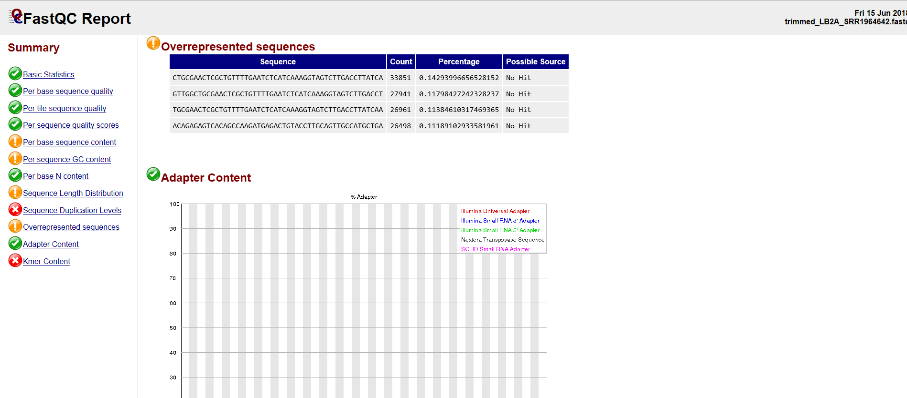

# Model-based RNA-Seq analysis
# Differential expression using a reference genome and pre-existing annotation. 

This repository is a publicly available tutorial for differential expression analysis using RNA-Seq data. All steps have been provided for the UConn CBC Xanadu cluster here with appropriate headers for the Slurm scheduler that can be modified simply to run.  Commands should never be executed on the submit nodes of any HPC machine.  If working on the Xanadu cluster, you should use `sbatch scriptname` after modifying the script for each stage.  Basic editing of all scripts can be performed on the server with tools such as `nano`, `vim`, or `emacs`.  If you are new to Linux, please use [this](https://bioinformatics.uconn.edu/unix-basics) handy guide for the operating system commands.  In this guide, you will be working with common bio Informatic file formats, such as [FASTA](https://en.wikipedia.org/wiki/FASTA_format), [FASTQ](https://en.wikipedia.org/wiki/FASTQ_format), [SAM/BAM](https://en.wikipedia.org/wiki/SAM_(file_format)), and [GFF3/GTF](https://en.wikipedia.org/wiki/General_feature_format). You can learn even more about each file format [here](https://bioinformatics.uconn.edu/resources-and-events/tutorials/file-formats-tutorial/). If you do not have a Xanadu account and are an affiliate of UConn/UCHC, please apply for one **[here](https://bioinformatics.uconn.edu/contact-us/)**.


Contents
1. [Overview](#1-overview)
2. [Accessing the Data using SRA-Toolkit](#2-accessing-the-data-using-sra-toolkit)  
3. [Quality control using Trimmomatic](#3-quality-control-using-Trimmomatic)
4. [FASTQC Before and After Quality Control](#4-fastqc-before-and-after-quality-control)
5. [Aligning Reads to a Genome using hisat2](#5-aligning-reads-to-a-genome-using-hisat2)
6. [Generating Total Read Counts from Alignment using htseq-count](#6-generating-total-read-counts-from-alignment-using-htseq-count)
7. [Pairwise differential expression with counts in R with DESeq2](#7-pairwise-differential-expression-with-counts-in-r-using-deseq2)
	1. [Common plots for differential expression analysis](#common-plots-for-differential-expression-analysis)
	2. [Using DESeq2](#using-deseq2)
8. [Getting gene annotations with `biomaRt`](#8-getting-gene-annotations-with-biomart)
9. [Gene ontology enrichment with `goseq` and `gProfiler`](#9-gene-ontology-enrichment-with-goseq-and-gProfiler)  


## 1. Overview  

In this study, transcriptional responses to three environmental stresses were examined in the large yellow croaker (_Larimichthys crocea_): heat stress (LC2A), cold stress (LA2A) and a 21-day fast (LF1A). mRNA was extracted from livers from from fishes from the three treatments and a control (LB2A) and sequenced on an Illumina HiSeq 2000. Sequencing was single-end, and each sequence is 90bp. 

For the purposes of this tutorial, we will compare the control (LB2A) to the heat stress treatment (LC2A). 

#### Cloning the tutorial repository

To work through this tutorial, copy it to your home directory using the `git clone` command:

```bash
git clone < git-repository-path.git > 
```  

Once you clone the repository you can see the following folder structure: 

```
Marine/
├── raw_data
├── quality_control
├── fastqc
├── index
├── align
├── count
└── entap
```

#### SLURM scripts
The scripts provided are configured to use SLURM, the workload managing software used on the Xanadu cluster. Such software is necessary to manage and equitably distribute resources on large computing clusters with many users. 

Each script contains a header section which specifies computational resources (processors, memory) needed to run the job. SLURM then puts the job in a queue and the runs it when the resources become available. The header section looks like this:

```
#!/bin/bash
#SBATCH --job-name=JOBNAME
#SBATCH -n 1
#SBATCH -N 1
#SBATCH -c 1
#SBATCH --mem=1G
#SBATCH --partition=general
#SBATCH --qos=general
#SBATCH --mail-type=ALL
#SBATCH --mail-user=first.last@uconn.edu
#SBATCH -o %x_%j.out
#SBATCH -e %x_%j.err
```

Before beginning, you need to understand a few aspects of the Xanadu server. When first logging into Xanadu from your local terminal, you will be connected to a **submit node**. The submit node is meant to serve as an **interface** for users, and under no circumstances should you use it to do serious computation. If you do, the system administrators may kill your job and send you a mean e-mail about it. This may cause you to lose work, and worse, feel badly about yourself. On the submit node you may manage and inspect files, write and edit scripts, and do other very light duty work. To analyze data, you need to request access to one or more **compute nodes** through SLURM. This tutorial will not teach you how to configure the SLURM header. Therefore, before moving on, it would be helpful to read and master the topics covered in the [Xanadu tutorial](https://bioinformatics.uconn.edu/resources-and-events/tutorials-2/xanadu/) and our [guide to resource requests](https://github.com/CBC-UCONN/CBC_Docs/wiki/Requesting-resource-allocations-in-SLURM).


## 2. Accessing the Data using SRA-Toolkit    

Before we can get started, we need to get the data we're going to analyze. This dataset has been deposited in the [Sequence Read Archive (SRA)](https://www.ncbi.nlm.nih.gov/sra) at NCBI, a comprehensive collection of sequenced genetic data submitted by researchers. The beauty of the SRA is the ease with which genetic data becomes accessible to any scientist with an internet connection. Sets of sequences (usually all the sequences from a given sample within an experiment) in the SRA have a unique identifier. The set may be downloaded using a software module called the `sratoolkit`. There are a variety of commands in the `sratoolkit`, which I invite you to investigate for yourself at [here](https://www.ncbi.nlm.nih.gov/books/NBK158900/).  

An overview of the project data can be viewed [here](https://www.ncbi.nlm.nih.gov/bioproject/PRJNA280841/). 

We will download data from the control samples (LB2A) and the heat stress treatment (LC2A). The SRA accessions are as follows:

LB2A : SRR1964642, SRR1964643  
LC2A : SRR1964644, SRR1964645  

We have provided a script to download the data from the the SRA data using SRA-Toolkit using [this script](/raw_data/fastq_dump_xanadu.sh). It contains three sections. 

The SLURM header: 

```bash
#!/bin/bash
#SBATCH --job-name=fastq_dump_xanadu
#SBATCH -n 1
#SBATCH -N 1
#SBATCH -c 1
#SBATCH --mem=15G
#SBATCH --partition=general
#SBATCH --qos=general
#SBATCH --mail-type=ALL
#SBATCH --mail-user=first.last@uconn.edu
#SBATCH -o %x_%j.out
#SBATCH -e %x_%j.err
```

The download commands:

```
module load sratoolkit/2.8.1 

fastq-dump --gzip SRR1964642
fastq-dump --gzip SRR1964643
fastq-dump --gzip SRR1964644
fastq-dump --gzip SRR1964645
```

The line `module load sratoolkit/2.8.1` loads the `sratoolkit` so we can use it. Once downloaded, we rename the samples:  

```bash
mv SRR1964642.fastq.gz LB2A_SRR1964642.fastq.gz
mv SRR1964643.fastq.gz LB2A_SRR1964643.fastq.gz
mv SRR1964644.fastq.gz LC2A_SRR1964644.fastq.gz
mv SRR1964645.fastq.gz LC2A_SRR1964645.fastq.gz
```  

The full script for slurm scheduler can be found in the `raw_data` folder. Before running it, add your own e-mail address to the `--mail-user` option (or delete the line entirely if you don't want an e-mail notification when the job completes). 

When you're ready, you can execute the script by entering `sbatch fastq_dump_xanadu.sh` in the terminal. This submits the job to the SLURM scheduler. 

Once the job is completed the folder structure will look like this:  

```
raw_data/
|-- fastq_dump_xanadu_NNNN.err
|-- fastq_dump_xanadu_NNNN.out
|-- LB2A_SRR1964642.fastq.gz
|-- LB2A_SRR1964643.fastq.gz
|-- LC2A_SRR1964644.fastq.gz
`-- LC2A_SRR1964645.fastq.gz
```   

The sequence files are in fastq format and compressed using gzip (indicated by the `.gz`). It's good practice to keep sequence files compressed. Most bioinformatics programs can read them directly without needing to decompress them first, and it doesn't get in the way of inspecting them either. The `.out` and `.err` files are output produced by SLURM that you can use to troubleshoot if things go wrong. Lets have a look at at the contents of one of the fastq files:  

```bash
zcat LB2A_SRR1964642.fastq.gz | head -n 12

@SRR1964642.1 FCC355RACXX:2:1101:1476:2162 length=90
CAACATCTCAGTAGAAGGCGGCGCCTTCACCTTCGACGTGGGGAATCGCTTCAACCTCACGGGGGCTTTCCTCTACACGTCCTGTCCGGA
+SRR1964642.1 FCC355RACXX:2:1101:1476:2162 length=90
?@@D?DDBFHHFFGIFBBAFG:DGHDFHGHIIIIC=D<:?BBCCCCCBB@BBCCCB?CCBB<@BCCCAACCCCC>>@?@88?BCACCBB>
@SRR1964642.2 FCC355RACXX:2:1101:1641:2127 length=90
NGCCTGTAAAATCAAGGCATCCCCTCTCTTCATGCACCTCCTGAAATAAAAGGGCCTGAATAATGTCGTACAGAAGACTGCGGCACAGAC
+SRR1964642.2 FCC355RACXX:2:1101:1641:2127 length=90
#1=DDFFFHHHHGJJJJJIIIJIJGIIJJJIJIJJGIJIJJJJIJJJJJJIJJJIJJJJJJJGIIHIGGHHHHHFFFFFDEDBDBDDDDD
@SRR1964642.3 FCC355RACXX:2:1101:1505:2188 length=90
GGACAACGCCTGGACTCTGGTTGGTATTGTCTCCTGGGGAAGCAGCCGTTGCTCCACCTCCACTCCTGGTGTCTATGCCCGTGTCACCGA
+SRR1964642.3 FCC355RACXX:2:1101:1505:2188 length=90
CCCFFFFFHHFFHJJJIIIJHHJJHHJJIJIIIJEHJIJDIJJIIJJIGIIIIJGHHHHFFFFFEEEEECDDDDEDEDDDDDDDADDDDD
```  

Each sequence record has four lines. The first is the sequence name, beginning with `@`. The second is the nucleotide sequence. The third is a comment line, beginning with `+`, and which here only contains the sequence name again (it is often empty). The fourth are [phred-scaled base quality scores](https://en.wikipedia.org/wiki/Phred_quality_score), encoded by [ASCII characters](https://drive5.com/usearch/manual/quality_score.html). Follow the links to learn more, but in short, the quality scores give the probability a called base is incorrect. 

## 3. Quality Control Using `Trimmomatic`  

`Trimmomatic` is commonly used to trim low quality and adapter contaminated sequences. 

Our usage looks like this for a single sample:

```bash
module load Trimmomatic/0.39

java -jar $Trimmomatic SE \
	-threads 12 \
	../raw_data/LB2A_SRR1964642.fastq.gz \
	LB2A_SRR1964642_trim.fastq.gz \
	ILLUMINACLIP:TruSeq3-SE.fa:2:30:10 \
	SLIDINGWINDOW:4:20 \
	MINLEN:45
```

We call `SE` for single-end mode, we request 12 processor threads be used, and we specify the input and output file names. The `ILLUMINACLIP:TruSeq3-SE.fa:2:30:10` command searches for adapter sequence, so we provide a fasta file containing the adapters used in the library preparation, and the numbers control the parameters of adapter matching (see the [manual](http://www.usadellab.org/cms/?page=trimmomatic) for more details). `SLIDINGWINDOW:4:20` scans through the read, cutting the read when the average base quality in a 4 base window drops below 20. We linked to an explanation of phred-scaled quality scores above, but for reference, scores of 10 and 20 correspond to base call error probabilities of 0.1 and 0.01, respectively. `MINLEN:45` causes reads to be dropped if they have been trimmed to less than 45bp.[Here](https://www.frontiersin.org/articles/10.3389/fgene.2014.00013/full) is a useful paper on setting trimming parameters for RNA-seq. 

The full script for slurm scheduler is called [fastq_trimming.sh](/quality_control/fastq_trimming.sh) which can be found in the **quality_control/** folder. Navigate there and run the script by enteriing `sbatch fastq_trimming.sh` on the command-line. 

Following the `trimmomatic` run, the resulting file structure will look as follows:  

```bash
quality_control/
├── fastq_trimming_NNNNN.err
├── fastq_trimming_NNNNN.out
├── fastq_trimming.sh
├── LB2A_SRR1964642_trim.fastq.gz
├── LB2A_SRR1964643.trim.fastq.gz
├── LC2A_SRR1964644.trim.fastq.gz
├── LC2A_SRR1964645.trim.fastq.gz
└── TruSeq3-SE.fa
```  

Examine the .out file generated during the run. Summaries of how many reads were retained for each file were written there. Here's one example:

```
TrimmomaticSE: Started with arguments:
 -threads 12 ../raw_data/LB2A_SRR1964642.fastq.gz LB2A_SRR1964642_trim.fastq.gz ILLUMINACLIP:TruSeq3-SE.fa:2:30:10 SLIDINGWINDOW:4:20 MINLEN:45
Using Long Clipping Sequence: 'AGATCGGAAGAGCGTCGTGTAGGGAAAGAGTGTA'
Using Long Clipping Sequence: 'AGATCGGAAGAGCACACGTCTGAACTCCAGTCAC'
ILLUMINACLIP: Using 0 prefix pairs, 2 forward/reverse sequences, 0 forward only sequences, 0 reverse only sequences
Quality encoding detected as phred33
Input Reads: 26424138 Surviving: 25664909 (97.13%) Dropped: 759229 (2.87%)
TrimmomaticSE: Completed successfully

```  

## 4. `FASTQC` Before and After Quality Control

It is helpful to see how the quality of the data has changed after using `Trimmomatic`. To do this, we will be using the command-line versions of `fastqc` and `MultiQC`. These two programs create visual reports of the average quality of our reads.  

```bash
dir="before"

module load fastqc/0.11.5
fastqc --outdir ./"$dir"/ ../raw_data/LB2A_SRR1964642.fastq.gz
fastqc --outdir ./"$dir"/ ../raw_data/LB2A_SRR1964643.fastq.gz
fastqc --outdir ./"$dir"/ ../raw_data/LC2A_SRR1964644.fastq.gz
fastqc --outdir ./"$dir"/ ../raw_data/LC2A_SRR1964645.fastq.gz
```  

The full script for slurm scheduler is called [fastqc_raw.sh](/fastqc/fastqc_raw.sh) and is located in the /fastqc folder.  

The same command can be run on the fastq files after the trimming using fastqc program, and the comand will look like this:
```bash
dir="after"

module load fastqc/0.11.5
fastqc --outdir ./"$dir"/ ../quality_control/LB2A_SRR1964642.trim.fastq.gz -t 8
fastqc --outdir ./"$dir"/ ../quality_control/LB2A_SRR1964643.trim.fastq.gz -t 8
fastqc --outdir ./"$dir"/ ../quality_control/LC2A_SRR1964644.trim.fastq.gz -t 8
fastqc --outdir ./"$dir"/ ../quality_control/LC2A_SRR1964645.trim.fastq.gz -t 8
```  

The full script for slurm scheduler is called [fastqc_trimmed.sh](/fastqc/fastqc_trimmed.sh) which is located in /fastqc folder.  
 
This will produce html files with the quality reports. The file strucutre inside the folder **fastqc/** will look like this:  

```
fastqc/
├── after
│   ├── trimmed_LB2A_SRR1964642_fastqc.html
│   ├── trimmed_LB2A_SRR1964642_fastqc.zip
│   ├── trimmed_LB2A_SRR1964643_fastqc.html
│   ├── trimmed_LB2A_SRR1964643_fastqc.zip
│   ├── trimmed_LC2A_SRR1964644_fastqc.html
│   ├── trimmed_LC2A_SRR1964644_fastqc.zip
│   ├── trimmed_LC2A_SRR1964645_fastqc.html
│   └── trimmed_LC2A_SRR1964645_fastqc.zip
├── before
│   ├── LB2A_SRR1964642_fastqc.html
│   ├── LB2A_SRR1964642_fastqc.zip
│   ├── LB2A_SRR1964643_fastqc.html
│   ├── LB2A_SRR1964643_fastqc.zip
│   ├── LC2A_SRR1964644_fastqc.html
│   ├── LC2A_SRR1964644_fastqc.zip
│   ├── LC2A_SRR1964645_fastqc.html
│   └── LC2A_SRR1964645_fastqc.zip
```  

To view the html files you need to download them to your laptop and open them in a web browser. You can use a xanadu node dedicated to file transfer: **transfer.cam.uchc.edu** and the unix utility `scp`. Copy the files as shown below, or use an FTP client with a graphical user interface such as FileZilla or Cyberduck: 

```bash
scp user-name@transfer.cam.uchc.edu:~/path/to/cloned/git/repository/fastqc/before/*.html .
```

The syntax is `scp x y`, meaning copy files `x` to location `y`. Do not forget the '**.**' at the end of the above code; which means to download the files to the current working directory in your computer. You can likewise download the **HTML** files for the trimmed reads. 
 
Let's have a look at the output from `fastqc`. When loading the fastqc file, you will be greeted with this screen  
  

There are some basic statistics which are all pretty self-explanatory. Notice that none of our sequence libraries fail the quality report! It would be concerning if we had even one because this report is from our trimmed sequence! The same thinking applies to our sequence length. Should the minimum of the sequence length be below 45, we would know that Trimmomatic had not run properly. Let's look at the next index in the file:  

  

This screen is simply a box-and-whiskers plot of our quality scores per base pair. Note that there is a large variance and lower mean scores (but still about in our desired range) for base pairs 1-5 and that sequence quality declines toward the 3' end of the read.  

  

This figure shows the distribution of mean read qualities. You can see we have a peak at about 38, which corresponds to a per base error probability of 0.00016. 

The last panel at which we are going to look is the "Overrepresented Sequences" panel:  
  

This is simply a list of sequences which appear disproportionately in our reads file. FastQC checks these against common adapter sequences and will flag them as such if they match. It is often the case in RNA-Seq that sequence from very highly expressed genes turns up in this panel. It may be helpful to try to identify some of these sequences using BLAST if they take up a large percentage of your library. 

When you have a large experiment with many samples, checking FastQC HTML files can be a tedious task. To get around this, you can use use a program called [MultiQC](https://multiqc.info/) to combine them into a single report. 

For HTML files in the **before/** folder:
```bash
module load MultiQC/1.1

multiqc --outdir raw_multiqc ./before/
``` 

For HTML file in the **after/** folder:
```bash
module load MultiQC/1.1

multiqc --outdir trimmed_multiqc ./after/
```  

The full slurm scripts are called [multiqc_raw.sh](/fastqc/multiqc_raw.sh) and [multiqc_trimmed.sh](/fastqc/multiqc_trimmed.sh) which can be found in the **fastqc/** folder.  As discribed above you may have to transfer these file to your computer to view them.


## 5. Aligning Reads to a Genome using `HISAT2`  

#### Downloading the genome and building the Index:  

HISAT2 is a fast and sensitive aligner for mapping next generation sequencing reads against a reference genome.
In order to map the reads to a reference genome we have to do a few things to prepare. First we must download the reference genome! We will download the reference genome (http://useast.ensembl.org/Larimichthys_crocea/Info/Index) from the ENSEMBL database using the `wget` command.  

```bash
wget ftp://ftp.ensembl.org/pub/release-100/fasta/larimichthys_crocea/dna/Larimichthys_crocea.L_crocea_2.0.dna.toplevel.fa.gz
gunzip Larimichthys_crocea.L_crocea_2.0.dna.toplevel.fa.gz
```

Next, we need to create a genome _index_. What is an index and why is it helpful? Genome indexing is the same as indexing a tome, like an encyclopedia. It is much easier to locate information in the vastness of an encyclopedia when you consult the index, which is ordered in an easily navigable way with pointers to the information you seek within. Genome indexing similarly structures the information contained in a genome so that a read mapper can quickly find possible mapping locations. 

We will use the `hisat2-build` module to make a HISAT index file for the genome. It will create a set of files with the suffix .ht2, these files together comprise the index. The command to generate the index looks like this: 

```bash
module load hisat2/2.0.5
hisat2-build -p 16 Larimichthys_crocea.L_crocea_2.0.dna.toplevel.fa L_crocea
```  

The full script can be found in the **index** folder by the name [hisat2_index.sh](/index/hisat2_index.sh). Navigate there and submit it by entering `sbatch hisat2_index.sh` on the command-line.   

After running the script, the following files will be generated as part of the index.  To refer to the index for mapping the reads in the next step, you will use the file prefix, which in this case is: L_crocea  

```bash
index/
|-- Larimichthys_crocea.L_crocea_2.0.dna.toplevel.fa
|-- hisat2_index.sh
|-- L_crocea.1.ht2
|-- L_crocea.2.ht2
|-- L_crocea.3.ht2
|-- L_crocea.4.ht2
|-- L_crocea.5.ht2
|-- L_crocea.6.ht2
|-- L_crocea.7.ht2
`-- L_crocea.8.ht2
```

### Aligning the reads using `HISAT2`  

Once we have created the index, the next step is to align the reads to the reference genome with `HISAT2`. By default `HISAT2` outputs the alignments in SAM format. We won't go over the format in detail in this tutorial, but should you actually need to look at the alignment files, it would be helpful to read over the [format specification](https://samtools.github.io/hts-specs/SAMv1.pdf) or have a look the [wikipedia page](https://en.wikipedia.org/wiki/SAM_(file_format)). 

Raw SAM formatted files have two issues. First, they are uncompressed. Because of this they take up much more space than they need to and are slower to read and write. Second, `HISAT2` writes the alignments out in the same order it reads the sequences from the fastq file, but for downstream applications, they need to be sorted by **genome coordinate**. 

To deal with these issues, we'll use a _pipe_ to send the results from `HISAT2` to `samtools` to sort the sequences, convert them to binary format and compress them. The resulting files will be in BAM format. We can then use `samtools` to read or otherwise manipulate them. We use pipes rather than writing intermediate files because it is much more efficient computationally, and requires less cleanup of unneeded intermediate files. 

Here's our code for aligning one sample:

```bash
hisat2 -p 8 --dta -x ../index/L_crocea -U ../quality_control/LB2A_SRR1964642_trim.fastq.gz | \
	samtools view -S -h -u - | \
	samtools sort -T SRR1964642 - >LB2A_SRR1964642.bam
```  

The `|` is the pipe. It tells linux to use the output of the command to the left of the pipe as the input for the command to the right. You can chain together many commands using pipes. `samtools view` converts the SAM file produced by `hisat2` to uncompressed BAM. `-S` indicates the input is SAM format. `-h` indicates the SAM header should be written to the output. `-u` indicates that uncompressed BAM format should be written (no need to compress until the end). `-` indicates `samtools` should take input from the pipe. `samtools sort` sorts and compressed the file. `-T` gives a temporary file prefix. 

Because BAM files are large and we may want to access specific sections quickly, we need to _index_ the bam files, just like we indexed the genome. Here we'll use `samtools` again. As an example:

```bash
samtools index LB2A_SRR1964642.bam
```

This creates a `.bam.bai` index file to accompany each BAM file. 

Once the mapping and indexing have been completed, the file structure is as follows:  
```bash
align/
├── align_NNNNNN.err
├── align_NNNNNN.out
├── align.sh
├── LB2A_SRR1964642.bam
├── LB2A_SRR1964642.bam.bai
├── LB2A_SRR1964643.bam
├── LB2A_SRR1964643.bam.bai
├── LC2A_SRR1964644.bam
├── LC2A_SRR1964644.bam.bai
├── LC2A_SRR1964645.bam
└── LC2A_SRR1964645.bam.bai
```  

The full script for the slurm scheduler can be found in the **align/** directory by the name [align.sh](/align/align.sh). When you're ready, navigate there and execute it by entering `sbatch align.sh` on the command-line. 

When `HISAT2` finishes aligning all the reads, it will write a summary which will be captured by SLURM in the file ending `.err`. 

An alignment summary for a single sample is shown below: 
```
25664909 reads; of these:
  25664909 (100.00%) were unpaired; of these:
    1114878 (4.34%) aligned 0 times
    23209585 (90.43%) aligned exactly 1 time
    1340446 (5.22%) aligned >1 times
95.66% overall alignment rate
```  

Let's have a look at the BAM file:
```bash
module load samtools/1.9
samtools view -H LB2A_SRR1964642.bam | head
```

which will give:
```bash
@HD	VN:1.0	SO:coordinate
@SQ	SN:NC_040011.1	LN:43682218
@SQ	SN:NC_040012.1	LN:14376772
@SQ	SN:NC_040013.1	LN:52095323
@SQ	SN:NC_040014.1	LN:6444570
@SQ	SN:NC_040015.1	LN:5657075
@SQ	SN:NC_040016.1	LN:27037660
@SQ	SN:NC_040017.1	LN:29365971
@SQ	SN:NC_040018.1	LN:33955600
@SQ	SN:NC_040019.1	LN:13800884
```

Here we've requested that `samtools` return only the header section, which contains lots of metadata about the file, including all the contig names in the genome (each @SQ line contains a contig name). Each line begins with an "@" sign. The header can be quite large, especially if there are many contigs in your reference. 

We can use `samtools` to access reads mapping to any part of the genome using the `view` submodule like this:

`samtools view LB2A_SRR1964642.bam NC_040019.1:171000-172000`

This will print to the screen all the reads that mapped to the genomic interval `NC_040019.1:171000-172000`. 

You can use pipes and other linux tools to get basic information about these reads:

`samtools view LB2A_SRR1964642.bam NC_040019.1:171000-172000 | wc -l`

`wc -l` counts lines of text, so this command indicates that 411 reads map to this 1kb interval. 


## 6. Generating Total Read Counts from Alignment using htseq-count  

Now we will be using the program `htseq-count` to count how many reads map to each annotated gene in the genome. To do this, we first need to download the annotation file. It is in GFF format. It can be done using the following command:  

```bash
wget ftp://ftp.ensembl.org/pub/release-100/gtf/larimichthys_crocea/Larimichthys_crocea.L_crocea_2.0.100.gtf.gz
gunzip Larimichthys_crocea.L_crocea_2.0.100.gtf.gz
```   
Once downloaded and unziped, then you can count the features using the `htseq-count` program.  

```bash
htseq-count -s no -r pos -f bam ../align/LB2A_SRR1964642.bam Larimichthys_crocea.L_crocea_2.0.100.gtf > LB2A_SRR1964642.counts
```
- `-s no` indicates we're using an unstranded RNA-seq library. 
- `-r pos` tells `htseq-count` that our BAM file is coordinate sorted. 
- `-f bam` indicates that our input file is in BAM format. 


The above command should be repeated for all other BAM files as well. The full script for slurm scheduler can be found in the **count/** folder which is called [htseq_count.sh](/count/htseq_count.sh).  

Once all the bam files have been counted, the following files will be found in the count directory.  
```bash
count/
├── htseq_count_NNNNN.err
├── htseq_count_NNNNN.out
├── htseq_count.sh
├── Larimichthys_crocea.L_crocea_2.0.100.gtf
├── LB2A_SRR1964642.counts
├── LB2A_SRR1964643.counts
├── LC2A_SRR1964644.counts
└── LC2A_SRR1964645.counts
```  

Let's have a look at the contents of a counts file:

```bash
head LB2A_SRR1964642.counts 
```

which will look like:  

```
ENSLCRG00005000002	0
ENSLCRG00005000003	2922
ENSLCRG00005000004	0
ENSLCRG00005000005	28885
ENSLCRG00005000006	0
ENSLCRG00005000007	5923
ENSLCRG00005000008	0
ENSLCRG00005000009	0
ENSLCRG00005000010	0
ENSLCRG00005000011	10255
``` 

We see the layout is quite straightforward, with two columns separated by a tab. The first column gives the Ensembl gene ID, the second column is the number of mRNA fragments that mapped to the gene. These counts are the raw material for the differential expression analysis in the next section. 


## 7. Pairwise Differential Expression with Counts in R using DESeq2  

To identify differentially expressed (DE) genes, we will use the `R` package `DESeq2`, a part of the [Bioconductor](https://www.bioconductor.org/about/) project. After the counts have been generated, typical differential expression analyses can be done easily on laptop computers, so we'll run this part of the analysis locally, instead of on the Xanadu cluster. 

To download the appropriate files to your local computer, you can use the secure copy client, `scp`. Close your Xanadu connection and run the following code:  

```bash
scp user_name@transfer.cam.uchc.edu:/Path-to-counts/*.counts /path-to-your-local-directory/  
```  

You may also use an FTP client with a graphical user interface such as FileZilla or Cyberduck. `transfer.cam.uchc.edu` is the server used to transfer files of small to moderate size (e.g < 1GB). 

Typical DE analyses involve both a statistical analysis, which is used to rigorously identify genes of interest and their effect sizes, and data visualization, which is used both as a way of illustrating results and as a form of quality control. Even a quick examination of some of the plots we'll make below can reveal problematic samples or unexpected heterogeneity within treatment groups that could bias results, or to put things in a more positive light, inspire new analyses or interpretations. 

### Launching `R`

For this tutorial, we'll assume you're using `RStudio`, but however you launch R, it's always a good idea to ensure you begin a new project with a clean workspace. In `RStudio` we recommend you select "File > New Project" and start a new R project in whatever directory you choose. 

### Beginning the statistical analysis

After you start a new project, you can edit and run the following code:

```R
# Load DESeq2 library
library("DESeq2")

# create an object with the directory containing your counts:
	# !!edit this to point to your own count file directory!!
directory <- "../count"

# ensure the count files are where you think they are
list.files(directory)

sampleFiles <- list.files(directory, pattern = ".*counts", full.names = TRUE)

```

This will load `DESeq2` and set some R objects we'll use to tell `DESeq2` how and where to read and write files. Note that in this example, the code is expecting to find the "count" directory in the parent of the project directory (that's what ".." means). 

Now we'll create a data frame that connects sample names, treatments, and count files. `DESeq2` has a function that can use that table to read and format the data so that it can be analyzed. 

```R
# create a vector of sample names. ensure these are in the same order as the "sampleFiles" object!
sampleNames <- c("LB2A_1","LB2A_2","LC2A_1","LC2A_2")

# create a vector of conditions. again, mind that they are ordered correctly!
sampleCondition <- c("control","control","treated","treated")

# now create a data frame from these three vectors. 
sampleTable <- data.frame(
		sampleName = sampleNames,
		fileName = sampleFiles,
		condition = sampleCondition
		)

# look at the data frame to ensure it is what you expect:
sampleTable

# create the DESeq data object
ddsHTSeq <- DESeqDataSetFromHTSeqCount(
		sampleTable = sampleTable, 
		directory = directory, 
		design = ~ condition
		)
```

Now we have a "DESeqDataSet" object (you can see this by typing `is(ddsHTSeq)`). By default, the creation of this object will order your treatments alphabetically, and the fold changes will be calculated relative to the first factor. If you would like to choose the first factor (e.g. the control), it's best to set this explicitly in your code. We'll demonstrate that here even though our factor names ("control" and "treatment") already result in the correct order for this data set. 

```R
# To see the levels as they are now:
ddsHTSeq$condition

# To replace the order with one of your choosing, create a vector with the order you want:
treatments <- c("control","treated")

# Then reset the factor levels:
ddsHTSeq$condition <- factor(ddsHTSeq$condition, levels = treatments)

# verify the order
ddsHTSeq$condition
```

As a next step, we can toss out some genes with overall low expression levels. We won't have statistical power to assess differential expression for those genes anyway. This isn't strictly necessary because `DESeq2` does _independent filtering_ of results, but if you have a lot of samples or a complex experimental design, it can speed up the analysis. 

```R
# what does expression look like across genes?

# sum counts for each gene across samples
sumcounts <- rowSums(counts(ddsHTSeq))
# take the log
logsumcounts <- log(sumcounts,base=10)
# plot a histogram of the log scaled counts
hist(logsumcounts,breaks=100)

# you can see the typically high dynamic range of RNA-Seq, with a mode in the distribution around 1000 fragments per gene, but some genes up over 1 million fragments. 

# get genes with summed counts greater than 20
keep <- sumcounts > 20

# keep only the genes for which the vector "keep" is TRUE
ddsHTSeq <- ddsHTSeq[keep,]
```

Ok, now we can do the statistical analysis. All the steps are wrapped in a single function, `DESeq()`. 

```R
dds <- DESeq(ddsHTSeq)
```

When we run this function, a few messages will be printed to the screen:

```R
estimating size factors
estimating dispersions
gene-wise dispersion estimates
mean-dispersion relationship
final dispersion estimates
fitting model and testing
```

You can learn more in depth about the statistical model by starting with [this vignette](https://bioconductor.org/packages/devel/bioc/vignettes/DESeq2/inst/doc/DESeq2.html) and reading through some of the references to specific parts of the methods, but it will be helpful to explain a little here. 

- _estimating size factors_: This part of the analysis accounts for the fact that standard RNA-seq measures **relative abundances** of transcripts within each sample, not **absolute abundances** (i.e. transcripts/cell). Because of this, if libraries are sequenced to different depths, genes with identical expression levels will have different counts. It may seem that simply adjusting for sequencing depth could account for this issue, but changes in gene expression among samples complicate things, so a slightly more complex normalization is applied. 
- _four dispersion estimate steps_: `DESeq2` models the variance in the counts for each sample using a negative binomial distribution. In this distribution the variance in counts is determined by a _dispersion_ parameter. This parameter needs to be estimated for each gene, but for sample sizes typical to RNA-Seq (3-5 per treatment) there isn't a lot of power to estimate it accurately. The key innovation of packages like `DESeq2` is to assume genes with similar expression have similar dispersions, and to pool information across them to estimate the dispersion for each gene. These steps accomplish that using an "empirical Bayesian" procedure. Without getting into detail, what this ultimately means is that the dispersion parameter for a particular gene is a _compromise_ between the signal in the data for that gene, and the signal in other, similar genes. 
- _fitting model and testing_: Once the dispersions are estimated, this part of the analysis asks if there are treatment effects for each gene. In the default case, DESeq2 uses a _Wald test_ to ask if the log2 fold change between two treatments is significantly different than zero. 

Once we've done this analysis, we can extract a nice clean table of the results from the messy R object:

```R
# get results table
res <- results(dds)

# get a quick summary of the table
summary(res)

# check out the first few lines
head(res)
```

In the results table there are six columns:

- _basemean_: the average of the normalized counts across samples. 
- _log2FoldChange_: the log2-scaled fold change. 
- _lfcSE_: standard error of log2 fold change. 
- _stat_: Wald statistic
- _pvalue_: raw p-value
- _padj_: A p-value adjusted for false discoveries. 

If we were interested in ranking the genes to look at, say, the top 20 most important, what would be the best factor? Log2 fold changes? Adjusted p-values? This is a tricky question. It turns out that both of these are not great because they are confounded with expression level. Genes with low expression can have extremely inflated fold changes, while genes with very high expression, but low fold changes, can have extremely low p-values. 

To deal with this, `DESeq2` provides a function for _shrinking_ the log2 fold changes. These shrunken log2 fold changes can be used to more robustly rank genes. Like the empirical Bayesian estimate of the dispersion parameter, this turns the log2 fold changes into a compromise between the signal in the data and a prior distribution that pulls them toward zero. If the signal in the data is weak, the log2 fold change is pulled toward zero, and the gene will be ranked lower. If the signal is strong, it resists the pull. This does not impact the p-values. 

We can get the shrunken log fold changes like this:

```R
# get shrunken log fold changes
res_shrink <- lfcShrink(dds,coef="condition_treated_vs_control")

# plot the shrunken log2 fold changes against the raw changes:
plot(
	x=res$log2FoldChange,
	y=res_shrink$log2FoldChange,pch=20,
	cex=.2,
	col=1+(res$padj < 0.05),
	xlab="raw log2 fold change",
	ylab="shrunken log2 fold change"
	)
abline(0,1)

# get the top 20 genes by shrunken log2 fold change
res_shrink[order(-abs(res_shrink$log2FoldChange)),][1:20,]

```

### RNA-Seq data visualization

There are several different visualizations we can use to illustrate our results and check to ensure they are robust. 

We'll start with the standard __Bland-Altman, or MA plot__, which is a high-level summary of the results. 

```R
plotMA(res_shrink, ylim=c(-4,4))
```
MA-plots depict the log2 fold change in expression against the mean expression for each gene. In this case we're using the shrunken fold changes, but you can plot the raw ones as well. You don't typically learn much from an MA plot, but it does nicely illustrate that you can achieve significance (red dots) at a much smaller fold change for highly expressed genes. It can also be a first indication that a treatment causes primarily up or down-regulation. 

Next we'll make a __volcano plot__, a plot of the negative log-scaled adjusted p-value against the log2 fold change. 

```R
# negative log-scaled adjusted p-values
log_padj <- -log(res_shrink$padj,10)
log_padj[log_padj > 100] <- 100

# plot
plot(x=res_shrink$log2FoldChange,
     y=log_padj,
     pch=20,
     cex=.2,
     col=(log_padj > 10)+1, # color padj < 0.1 red
     ylab="negative log-scaled adjusted p-value",
     xlab="shrunken log2 fold changes")
```


Next we'll plot the the results of a __principal components analysis (PCA)__ of the expression data. For each sample in an RNA-Seq analysis, there are potentially tens of thousands of genes with expression measurements. A PCA attempts to explain the variation in all those genes with a smaller number of _principal components_. In an RNA-Seq analysis, we typically want to see if the PCs reveal any unexpected similarities or differences among samples in their overall expression profiles. A PCA can often quickly reveal outliers, sample labeling problems, or potentially problematic population structure. 


```R
# normalized, variance-stabilized transformed counts for visualization
vsd <- vst(dds, blind=FALSE)

plotPCA(vsd, intgroup="condition")

# alternatively, using ggplot
library(ggplot2)

dat <- plotPCA(vsd, intgroup="condition",returnData=TRUE)

p <- ggplot(dat,aes(x=PC1,y=PC2,col=group))
p + geom_point()
p
```

Here we used a _variance stabilized transformation_ of the count data in the PCA, rather than the normalized counts. This is an attempt to deal with the very high range in expression levels (6 orders of magnitude) and the many zeroes, and is similar to, but a bit more robust than simpler approaches, such as simply adding 1 and log2 scaling the normalized counts. 

You can see that in our case, the first PC, which explains 99% of the variance in gene expression, separates our two treatments. The high percent variance explained here is not a typical result. Most experiments are much messier, with much less variance explained. In studies with population structure, the first few PCs often reflect that structure, rather than treatment effects. 


Next we'll make a heatmap of the top 50 DE genes. 

```R
# load pheatmap library (install.packages(pheatmap) if you don't have it.)
library(pheatmap)

# regularized log transformation of counts
rld <- rlog(dds, blind=FALSE)

# get top 50 log fold change genes
top50 <- order(-abs(res_shrink$log2FoldChange))[1:50]
df <- data.frame(colData(dds)[,"condition"])
	rownames(df) <- colnames(dds)
	colnames(df) <- "condition"
pheatmap(
	assay(rld)[top50,], 
	cluster_rows=TRUE, 
	show_rownames=TRUE,
	cluster_cols=FALSE,
	annotation_col=df
	)
```

This time we transformed the counts using a slightly different method, the _regularized logarithm_. In the plot, genes are clustered by their expression values, and the regularized, log-transformed expression values are used to color the cells. 


Finally, when you've got DE genes, it's always a good idea to at least spot check a few of them to see if the normalized counts seem consistent with expectations. This can reveal a few different problems. First, although `DESeq2` attempts to manage outliers, they can sometimes drive the signal of DE. If you're interested in hanging a bunch of interpretation on a few genes, it's always a good idea to check them. Second, unexpected heterogeneity within treatment groups can also drive signal. This is not the same as having outliers, and it may indicate problems with experimental procedures, or possibly something biologically interesting. Often this will also show up in a PCA or heatmap.

```R
plotCounts(dds, gene=order(-abs(res_shrink$log2FoldChange))[1], intgroup="condition")
```

Here we've plotted the gene with the largest shrunken log2 fold change. 


## 8. Getting gene annotations with `biomaRt`


BioMart is software that can query a variety of biological databases. `biomaRt` is an R package we can use to build those queries. Here we'll use `biomaRt` to retrieve gene annotations from the Ensembl database. 

```R
# load biomaRt
library(biomaRt) 


##############################
# Select a mart and dataset
##############################

# see a list of "marts" available at host "ensembl.org"
listMarts(host="ensembl.org")

# create an object for the Ensembl Genes v100 mart
mart <- useMart(biomart="ENSEMBL_MART_ENSEMBL", host="ensembl.org")

# see a list of datasets within the mart
	# at the time of writing, there were 203
listDatasets(mart)

# figure out which dataset is the croaker
	# be careful using grep like this. verify the match is what you want
searchDatasets(mart,pattern="lcrocea")

# there's only one match, get the name
croakerdata <- searchDatasets(mart,pattern="lcrocea")[,1]


# create an object for the croaker dataset
croaker_mart <- useMart(biomart = "ENSEMBL_MART_ENSEMBL", host = "ensembl.org", dataset = croakerdata)

#########################
# Query the mart/dataset
#########################

# filters, attributes and values

# see a list of all "filters" available for the lcrocea dataset.
	# at the time of writing, over 300
listFilters(croaker_mart)

# see a list of all "attributes" available
	# 129 available at the time of writing
listAttributes(mart = croaker_mart, page="feature_page")

# we can also search the attributes and filters
searchAttributes(mart = croaker_mart, pattern = "ensembl_gene_id")

searchFilters(mart = croaker_mart, pattern="ensembl")

# get gene names and transcript lengths when they exist
ann <- getBM(filter="ensembl_gene_id",value=rownames(res),attributes=c("ensembl_gene_id","description","transcript_length"),mart=croaker_mart)

# pick only the longest transcript for each gene ID
ann <- group_by(ann, ensembl_gene_id) %>% 
  summarize(.,description=unique(description),transcript_length=max(transcript_length))

go_ann <- getBM(filter="ensembl_gene_id",value=rownames(res),attributes=c("ensembl_gene_id","description","go_id","name_1006","namespace_1003"),mart=croaker_mart)

```

## 9. Gene ontology enrichment with `goseq` and `gProfiler`

Once we have a set of differentially expressed genes, we want to understand their biological significance. While it can be useful to skim through the list of DE genes, looking for interesting hits, taking a large-scale overview is often also helpful. One way to do that is to look for enrichment of functional categories among the DE genes. There are many, many tools to accomplish that, using several different kinds of functional annotations. Here we'll look at enrichment of [gene ontology](http://geneontology.org/) terms. The Gene Ontology (GO) is a controlled vocabulary describing functional attributes of genes. Above, we retrieved GO terms for the genes we assayed in our experiment. Here we will ask whether they are over- (or under-) represented among our DE genes. 

We're going to use two tools: a Bioconductor package, `goseq` and a web-based program, `gProfiler`. 

`goseq` can pull annotations automatically for some organisms, but not _L. crocea_, so we'll need to put together our input data. We need:

- A vector of 1's and 0's indicating whether each gene is DE or not. 
- A vector of transcript lengths for each gene (the method tries to account for this source of bias). 
- A table mapping GO terms to gene IDs (this is the object `go_ann`, created above)

```R
# 0/1 vector for DE/not DE
de <- as.numeric(res$padj < 0.1)
names(de) <- rownames(res)

# length of each gene (already extracted using biomart)
len <- ann[[3]]
```

Now we can start the analysis:

```R
# first try to account for transcript length bias by calculating the
# probability of being DE based purely on gene length
pwf <- nullp(DEgenes=de,bias.data=len)

# use the Wallenius approximation to calculate enrichment p-values
GO.wall <- goseq(pwf=pwf,gene2cat=go_ann[,c(1,3)])

# do FDR correction on p-values using Benjamini-Hochberg, add to output object
GO.wall <- cbind(
  GO.wall,
  padj_overrepresented=p.adjust(GO.wall$over_represented_pvalue, method="BH"),
  padj_underrepresented=p.adjust(GO.wall$under_represented_pvalue, method="BH")
  )
```

And that's it. We now have our output, and we can explore it a bit. Here we'll just pick the one of the top enriched GO terms, pull out all the corresponding genes and plot their log2 fold-changes. 

```R
# explore the results

head(GO.wall)

# get genes corresponding to 2nd from top enriched GO term
g <- go_ann$go_id==GO.wall[2,1]
gids <- go_ann[g,1]

# inspect results
res_ann[gids,]

# plot l2fc
ord <- order(res_ann[gids,]$log2FoldChange)
plot(res_ann[gids,]$log2FoldChange[ord],
     ylab="l2fc of genes in top enriched GO term",
     col=(res_ann[gids,]$padj[ord] < 0.1) + 1,
     pch=20,cex=.5)
abline(h=0,lwd=2,lty=2,col="gray")

```

We can execute a similar analysis using the web server `gProfiler`. First, get a list of DE gene IDs:

```R
cat(rownames(res)[res$padj < 0.1])
```
Copy the text to your clipboard. Then visit [gProfiler](https://biit.cs.ut.ee/gprofiler/gost). Select _Laramichtys crocea_ as the organism. Paste the output into the query window and press "Run Query". Explore the results. We should see extremely similar enrichment terms. 

A major difference between these analyses is the background set of genes considered. We only give `gProfiler` our list of DE genes. It compares those against the total set of gene annotations in _L. crocea_ (nearly 24,000 genes). `goseq`, by contrast, is using only the set of genes we included in the analysis (only about 14,000). 


## Writing out results

Finally, we can write somes results out to files like this:

```R
# set a prefix for output file names
outputPrefix <- "Croaker_DESeq2"

# save data results and normalized reads to csv
resdata <- merge(
	as.data.frame(res_shrink), 
	as.data.frame(counts(dds,normalized =TRUE)), 
	by = 'row.names', sort = FALSE
	)
names(resdata)[1] <- 'gene'

write.csv(resdata, file = paste0(outputPrefix, "-results-with-normalized.csv"))

# send normalized counts to tab delimited file for GSEA, etc.
write.table(
	as.data.frame(counts(dds),normalized=T), 
	file = paste0(outputPrefix, "_normalized_counts.txt"), 
	sep = '\t'
	)

```


