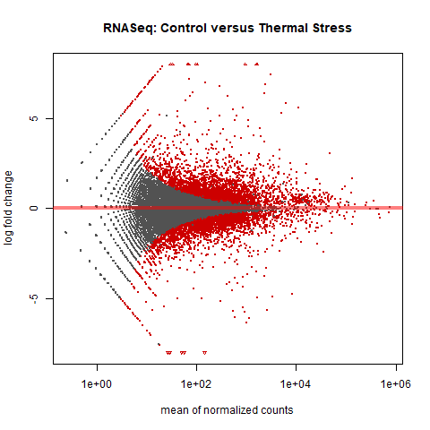
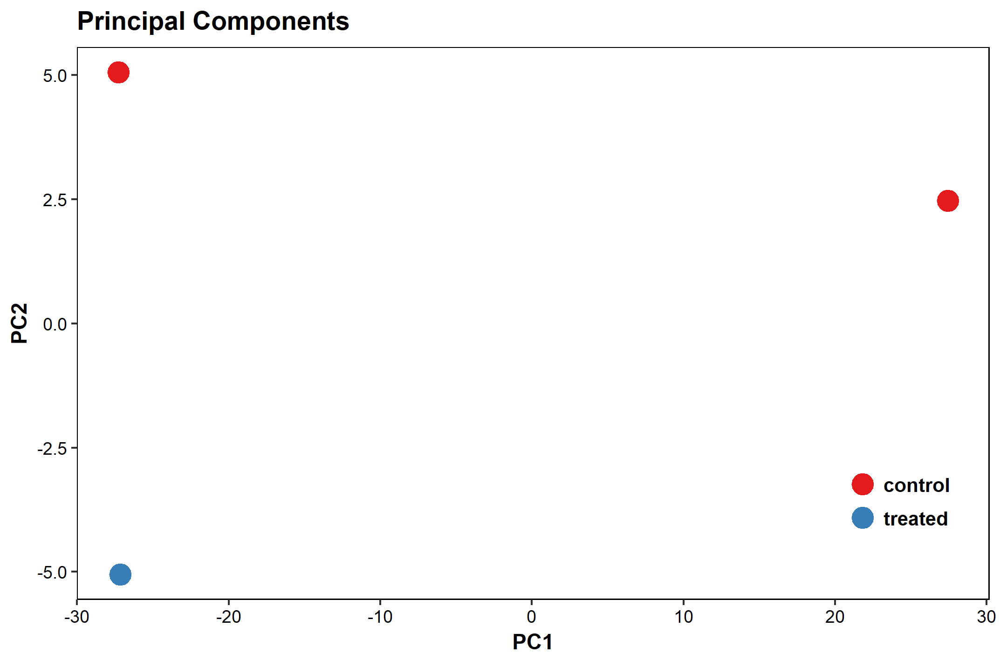
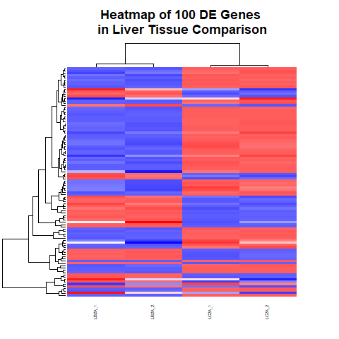

# Model Marine RNASeq and Functional Annotation
# RNA-Seq: Reference Genome, Differential Expression, and Functional Annotation

This repository is a usable, publicly available tutorial for analyzing differential expression data and creating topological gene networks. All steps have been provided for the UConn CBC Xanadu cluster here with appropriate headers for the Slurm scheduler that can be modified simply to run.  Commands should never be executed on the submit nodes of any HPC machine.  If working on the Xanadu cluster, you should use sbatch scriptname after modifying the script for each stage.  Basic editing of all scripts can be performed on the server with tools such as nano, vim, or emacs.  If you are new to Linux, please use [this](https://bioinformatics.uconn.edu/unix-basics) handy guide for the operating system commands.  In this guide, you will be working with common bio Informatic file formats, such as [FASTA](https://en.wikipedia.org/wiki/FASTA_format), [FASTQ](https://en.wikipedia.org/wiki/FASTQ_format), [SAM/BAM](https://en.wikipedia.org/wiki/SAM_(file_format)), and [GFF3/GTF](https://en.wikipedia.org/wiki/General_feature_format). You can learn even more about each file format [here](https://bioinformatics.uconn.edu/resources-and-events/tutorials/file-formats-tutorial/). If you do not have a Xanadu account and are an affiliate of UConn/UCHC, please apply for one **[here](https://bioinformatics.uconn.edu/contact-us/)**.


Contents
1. [Overview](#1-overview)
2. [Accessing the Data using SRA-Toolkit](#2-accessing-the-data-using-sra-toolkit)  
3. [Quality control using sickle](#3-quality-control-using-sickle)
4. [FASTQC Before and After Quality Control](#4-fastqc-before-and-after-quality-control)
5. [Aligning Reads to a Genome using hisat2](#5-aligning-reads-to-a-genome-using-hisat2)
6. [Generating Total Read Counts from Alignment using htseq-count](#6-generating-total-read-counts-from-alignment-using-htseq-count)
7. [Pairwise differential expression with counts in R with DESeq2](#7-pairwise-differential-expression-with-counts-in-r-using-deseq2)
	1. [Common plots for differential expression analysis](#common-plots-for-differential-expression-analysis)
	2. [Using DESeq2](#using-deseq2)
7. [EnTAP: Functional Annotation for Genomes](#8-entap--functional-annotation-for-de-genes)
8. [Integrating the DE Results with the Annotation Results](#9-integrating-the-de-results-with-the-annotation-results)  


## 1. Overview  

Liver mRNA profiles large yellow croaker (Larimichthys crocea) species are sampled during various conditions namely, control group (LB2A), thermal stress group (LC2A), cold stress group (LA2A) and 21-day fasting group (LF1A) were generated by RNA-seq, using Illumina HiSeq 2000.  

We will only use the control group (LB2A) and the thermal stress group (LC2A) 


#### Cloning the workflow
The workflow may be cloned into the appropriate directory using the terminal command:  
```bash
git clone < git-repository-path.git > 
```  

Once you clone the repository you can see the following folder structure: 
```
Marine/
├── raw_data
├── quality_control
├── fastqc
├── index
├── align
├── count
└── entap
```

#### SLURM scripts
The tutorial will be using SLURM schedular to submit jobs to Xanadu cluster. In each script we will be using it will contain a header section which will allocate the resources for the SLURM schedular. The header section will contain:

```
#!/bin/bash
#SBATCH --job-name=JOBNAME
#SBATCH -n 1
#SBATCH -N 1
#SBATCH -c 1
#SBATCH --mem=1G
#SBATCH --partition=general
#SBATCH --qos=general
#SBATCH --mail-type=ALL
#SBATCH --mail-user=first.last@uconn.edu
#SBATCH -o %x_%j.out
#SBATCH -e %x_%j.err
```

Before beginning, we need to understand a few aspects of the Xanadu server. When first logging into Xanadu from your local terminal, you will be connected to the submit node. The submit node is the interface with which users on Xanadu may submit their processes to the desired compute nodes, which will run the process. Never, under any circumstance, run processes directly in the submit node. Your process will be killed and all of your work lost! This tutorial will not teach you shell script configuration to submit your tasks on Xanadu. Therefore, before moving on, read and master the topics covered in the [Xanadu tutorial](https://bioinformatics.uconn.edu/resources-and-events/tutorials-2/xanadu/).


## 2. Accessing the Data using SRA-Toolkit    


We will be downloading our data from the sequence-read-archives (SRA), a comprehensive collection of sequenced genetic data submitted to the NCBI by experimenters. The beauty of the SRA is the ease with which genetic data becomes accessible to any scientist with an internet connection, available for download in a variety of formats. Each run in the SRA has a unique identifier. The run may be downloaded using a module of software called the "sratoolkit" and its unique identifier. There are a variety of commands in the sratoolkit, which I invite you to investigate for yourself at https://www.ncbi.nlm.nih.gov/books/NBK158900/.  

The data may be accessed at the following web page: https://www.ncbi.nlm.nih.gov/bioproject/28084  
LB2A : SRR1964642, SRR1964643  
LC2A : SRR1964644, SRR1964645  

We can download the SRA data using SRA-Toolkit using the following command:  
```bash
#!/bin/bash
#SBATCH --job-name=fastq_dump_xanadu
#SBATCH -n 1
#SBATCH -N 1
#SBATCH -c 1
#SBATCH --mem=15G
#SBATCH --partition=general
#SBATCH --qos=general
#SBATCH --mail-type=ALL
#SBATCH --mail-user=first.last@uconn.edu
#SBATCH -o %x_%j.out
#SBATCH -e %x_%j.err

echo `hostname`

module load sratoolkit/2.8.1  
fastq-dump SRR1964642  
fastq-dump SRR1964643
fastq-dump SRR1964644  
fastq-dump SRR1964645  
```

Once the download is complete, we will rename the according to the samples for easy identification.  
```bash
mv SRR1964642.fastq LB2A_SRR1964642.fastq
mv SRR1964643.fastq LB2A_SRR1964643.fastq
mv SRR1964644.fastq LC2A_SRR1964644.fastq
mv SRR1964645.fastq LC2A_SRR1964645.fastq
```  

The full script for slurm scheduler can be found in the raw_data folder by the name [fastq_dump_xanadu.sh](/raw_data/fastqc_dump_xanadu.sh).  

It is advised that you familiarize yourself with the arguments for the Slurm scheduler. While it may seem as though running your commands locally will be more efficient due to the hassle of not initializing and writing scripts, do not fall for that trap! The capacity of the Slurm scheduler far exceeds the quickness of entering the commands locally. While the rest of this tutorial will not include the process of initializing and writing the Slurm arguments in a script in its coding, know that the Xanadu scripts in the cloned directory do contain the Slurm arguments. However, before running any cloned Xanadu script, you must edit and enter your appropriate email address!  

Once the download and the renaming is done the folder structure will look like:  
```bash
raw_data/
|-- LB2A_SRR1964642.fastq
|-- LB2A_SRR1964643.fastq
|-- LC2A_SRR1964644.fastq
`-- LC2A_SRR1964645.fastq
```   

Lets have a look at athe contents of one of the fastq-files:  
```bash
head -n 12 LB2A_SRR1964642.fastq

@SRR1964642.1 FCC355RACXX:2:1101:1476:2162 length=90
CAACATCTCAGTAGAAGGCGGCGCCTTCACCTTCGACGTGGGGAATCGCTTCAACCTCACGGGGGCTTTCCTCTACACGTCCTGTCCGGA
+SRR1964642.1 FCC355RACXX:2:1101:1476:2162 length=90
?@@D?DDBFHHFFGIFBBAFG:DGHDFHGHIIIIC=D<:?BBCCCCCBB@BBCCCB?CCBB<@BCCCAACCCCC>>@?@88?BCACCBB>
@SRR1964642.2 FCC355RACXX:2:1101:1641:2127 length=90
NGCCTGTAAAATCAAGGCATCCCCTCTCTTCATGCACCTCCTGAAATAAAAGGGCCTGAATAATGTCGTACAGAAGACTGCGGCACAGAC
+SRR1964642.2 FCC355RACXX:2:1101:1641:2127 length=90
#1=DDFFFHHHHGJJJJJIIIJIJGIIJJJIJIJJGIJIJJJJIJJJJJJIJJJIJJJJJJJGIIHIGGHHHHHFFFFFDEDBDBDDDDD
@SRR1964642.3 FCC355RACXX:2:1101:1505:2188 length=90
GGACAACGCCTGGACTCTGGTTGGTATTGTCTCCTGGGGAAGCAGCCGTTGCTCCACCTCCACTCCTGGTGTCTATGCCCGTGTCACCGA
+SRR1964642.3 FCC355RACXX:2:1101:1505:2188 length=90
CCCFFFFFHHFFHJJJIIIJHHJJHHJJIJIIIJEHJIJDIJJIIJJIGIIIIJGHHHHFFFFFEEEEECDDDDEDEDDDDDDDADDDDD
```  

We see that for our first three runs we have information about the sampled read including its length followed by the nucleotide read and then a "+" sign. The "+" sign marks the beginning of the corresponding scores for each nucleotide read for the nucleotide sequence preceding the "+" sign.  


## 3. Quality Control Using Sickle  

Sickle performs quality control on illumina paired-end and single-end short reads data. To check the options provided by sickle program:   
```bash
module load sickle
```

which will load the sickle program and to check the usage, just type `sickle` on the terminal window.  
```bash 
Usage: sickle  [options]

Command:
pe	paired-end sequence trimming
se	single-end sequence trimming

--help, display this help and exit
--version, output version  Information and exit
```  

Since we have single end sequences, typing `sickle se` will give the single-end-read options:
```bash
Usage: sickle se [options] -f  -t  -o 

Options:
-f, --fastq-file, Input fastq file (required)
-t, --qual-type, Type of quality values (solexa (CASAVA < 1.3), illumina (CASAVA 1.3 to 1.7), sanger (which is CASAVA >= 1.8)) (required)
-o, --output-file, Output trimmed fastq file (required)
-q, --qual-threshold, Threshold for trimming based on average quality in a window. Default 20.
-l, --length-threshold, Threshold to keep a read based on length after trimming. Default 20.
-x, --no-fiveprime, Don't do five prime trimming.
-n, --trunc-n, Truncate sequences at position of first N.
-g, --gzip-output, Output gzipped files.
--quiet, Don't print out any trimming  Information
--help, display this help and exit
--version, output version  Information and exit
```  

The quality may be any score from 0 to 40. The default of 20 is much too low for a robust analysis. We want to select only reads with a quality of 35 or better. Additionally, the desired length of each read is 50bp. Again, we see that a default of 20 is much too low for analysis confidence. We want to select only reads whose lengths exceed 45bp. Lastly, we must know the scoring type. While the quality type is not listed on the SRA pages, most SRA reads use the "sanger" quality type. Unless explicitly stated, try running sickle using the sanger qualities. If an error is returned, try illumina. If another error is returned, lastly try solexa.  

Let's put all of this together for our sickle script using our downloaded fastq files:
```bash
module load sickle/1.33

sickle se -f ../raw_data/LB2A_SRR1964642.fastq -t sanger -o trimmed_LB2A_SRR1964642.fastq -q 30 -l 50
sickle se -f ../raw_data/LB2A_SRR1964643.fastq -t sanger -o trimmed_LB2A_SRR1964643.fastq -q 30 -l 50
sickle se -f ../raw_data/LC2A_SRR1964644.fastq -t sanger -o trimmed_LC2A_SRR1964644.fastq -q 30 -l 50
sickle se -f ../raw_data/LC2A_SRR1964645.fastq -t sanger -o trimmed_LC2A_SRR1964645.fastq -q 30 -l 50
```  

The full script for slurm scheduler is called [fastq_trimming.sh](/quality_control/fastq_trimming.sh) which can be found in the **quality_control/** folder.  

Following the sickle run, the resulting file structure will look as follows:  
```bash
quality_control/
├── fastq_trimming.sh
├── trimmed_LB2A_SRR1964642.fastq
├── trimmed_LB2A_SRR1964643.fastq
├── trimmed_LC2A_SRR1964644.fastq
└── trimmed_LC2A_SRR1964645.fastq
```  

Examine the .out file generated during the run. It will provide a summary of the quality control process.  
```
SE input file: ../raw_data/LB2A_SRR1964642.fastq

Total FastQ records: 26424138
FastQ records kept: 23681970
FastQ records discarded: 2742168


SE input file: ../raw_data/LB2A_SRR1964643.fastq

Total FastQ records: 26424138
FastQ records kept: 23064271
FastQ records discarded: 3359867


SE input file: ../raw_data/LC2A_SRR1964644.fastq

Total FastQ records: 25746094
FastQ records kept: 23273009
FastQ records discarded: 2473085


SE input file: ../raw_data/LC2A_SRR1964645.fastq

Total FastQ records: 25746094
FastQ records kept: 23586197
FastQ records discarded: 2159897
```  

## 4. FASTQC Before and After Quality Control
It is helpful to see how the quality of the data has changed after using sickle. To do this, we will be using the commandline versions of fastqc and MultiQC. These two programs simply create reports of the average quality of our trimmed reads, with some graphs.  

```bash
dir="before"

module load fastqc/0.11.5
fastqc --outdir ./"$dir"/ ../raw_data/LB2A_SRR1964642.fastq
fastqc --outdir ./"$dir"/ ../raw_data/LB2A_SRR1964643.fastq
fastqc --outdir ./"$dir"/ ../raw_data/LC2A_SRR1964644.fastq
fastqc --outdir ./"$dir"/ ../raw_data/LC2A_SRR1964645.fastq
```  

The full script for slurm scheduler is called [fastqc_raw.sh](/fastqc/fastqc_raw.sh) which is located in fastqc folder.  

The same command can be run on the fastq files after the trimming using fastqc program, and the comand will look like:
```bash
dir="after"

module load fastqc/0.11.5
fastqc --outdir ./"$dir"/ ../quality_control/trimmed_LB2A_SRR1964642.fastq -t 8
fastqc --outdir ./"$dir"/ ../quality_control/trimmed_LB2A_SRR1964643.fastq -t 8
fastqc --outdir ./"$dir"/ ../quality_control/trimmed_LC2A_SRR1964644.fastq -t 8
fastqc --outdir ./"$dir"/ ../quality_control/trimmed_LC2A_SRR1964645.fastq -t 8
```  

The full script for slurm scheduler is called [fastqc_trimmed.sh](/fastqc/fastqc_trimmed.sh) which is located in fastqc folder.  
 
This will produce the html files with the quality reports and the file strucutre in side the folder **fastqc/** will look like:  
```
fastqc/
├── after
│   ├── trimmed_LB2A_SRR1964642_fastqc.html
│   ├── trimmed_LB2A_SRR1964642_fastqc.zip
│   ├── trimmed_LB2A_SRR1964643_fastqc.html
│   ├── trimmed_LB2A_SRR1964643_fastqc.zip
│   ├── trimmed_LC2A_SRR1964644_fastqc.html
│   ├── trimmed_LC2A_SRR1964644_fastqc.zip
│   ├── trimmed_LC2A_SRR1964645_fastqc.html
│   └── trimmed_LC2A_SRR1964645_fastqc.zip
├── before
│   ├── LB2A_SRR1964642_fastqc.html
│   ├── LB2A_SRR1964642_fastqc.zip
│   ├── LB2A_SRR1964643_fastqc.html
│   ├── LB2A_SRR1964643_fastqc.zip
│   ├── LC2A_SRR1964644_fastqc.html
│   ├── LC2A_SRR1964644_fastqc.zip
│   ├── LC2A_SRR1964645_fastqc.html
│   └── LC2A_SRR1964645_fastqc.zip
```  

fastqc will create the **HTML files** in the **fastqc/** directory as shown above. To view the above files you may have to download them to your laptop using a **transfer.cam.uchc.edu** submit node as shown below: 

```bash
scp user-name@transfer.cam.uchc.edu:/UCHC/PublicShare/RNASeq_Workshop/Marine/fastqc/before/*.html .
```

Do not forget the '**.**' at the end of the above code; which means to download them to the current working directory in your computer. Likewise you can download the **HTML** files before timming and after trimming. 

 

Let's have a look at the file format from fastqc and multiqc. When loading the fastqc file, you will be greeted with this screen  
  

There are some basic statistics which are all pretty self-explanatory. Notice that none of our sequences fail the quality report! It would be concerning if we had even one because this report is from our trimmed sequence! The same thinking applies to our sequence length. Should the minimum of the sequence length be below 45, we would know that sickle had not run properly. Let's look at the next index in the file:  

  

This screen is simply a box-and-whiskers plot of our quality scores per base pair. Note that there is a large variance and lower mean scores (but still about in our desired range) for base pairs 1-5. These are the primer sequences! I will leave it to you to ponder the behavior of this graph. If you're stumped, you may want to learn how Illumina sequencing works.  

  

This index is simply the total number of base pairs (y-axis) which have a given quality score (x-axis). This plot is discontinuous and discrete, and should you calculate the Riemann sum the result is the total number of base pairs present across all reads.  

The last index at which we are going to look is the "Overrepresented Sequences" index:  
  

This is simply a list of sequences which appear disproportionately in our reads file. The reads file actually includes the primer sequences for this exact reason. When fastqc calculates a sequence which appears many times beyond the expected distribution, it may check the primer sequences in the reads file to determine if the sequence is a primer. If the sequence is not a primer, the result will be returned as "No Hit". Sequences which are returned as "No Hit" are most likely highly expressed genes.  

When you have multiple HTML files to view it will be become much more tedious to open each file at a time, and look at them. So to get all the HTML into a one file you can use a program called [MultiQC](https://multiqc.info/), which will combine these files. The code to do that is shown below:

For HTML files in the **before/** folder:
```bash
module load MultiQC/1.1

multiqc --outdir raw_multiqc ./before/
``` 

For HTML file in the **after/** folder:
```bash
module load MultiQC/1.1

multiqc --outdir trimmed_multiqc ./after/
```  

The full slurm scripts are called [multiqc_raw.sh](/fastqc/multiqc_raw.sh) and [multiqc_trimmed.sh](/fastqc/multiqc_trimmed.sh) which can be found in the **fastqc/** folder.  As discribed above you may have to transfer these file to your computer to view them.


## 5. Aligning Reads to a Genome using hisat2  

#### Building the Index:  
HISAT2 is a fast and sensitive aligner for mapping next generation sequencing reads against a reference genome.
In order to map the reads to a reference genome, first we must download the reference genome! Then we must make an index file. We will be downloading the reference genome (https://www.ncbi.nlm.nih.gov/genome/12197) from the ncbi database, using the wget command.  

```bash
wget ftp://ftp.ncbi.nlm.nih.gov/genomes/all/GCF/000/972/845/GCF_000972845.1_L_crocea_1.0/GCF_000972845.1_L_crocea_1.0_genomic.fna.gz
gunzip GCF_000972845.1_L_crocea_1.0_genomic.fna.gz
```

We will use the hisat2-build option to make a HISAT index file for the genome. It will create a set of files with the suffix .ht2, these files together build the index. What is an index and why is it helpful? Genome indexing is the same as indexing a tome, like an encyclopedia. It is much easier to locate information in the vastness of an encyclopedia when you consult the index, which is ordered in an easily navigatable way with pointers to the location of the information you seek within the encylopedia. Genome indexing is thus the structuring of a genome such that it is ordered in an easily navigatable way with pointers to where we can find whichever gene is being aligned. The genome index along with the trimmed fasta files are all you need to align the reads to the reference genome (the build command is included in the genome_indexing_and_alignment files, so it is not necessary to run now).  

```bash
module load hisat2/2.0.5
hisat2-build -p 4 GCF_000972845.1_L_crocea_1.0_genomic.fna L_crocea
```  

```bash
Usage: hisat2-build [options] <reference_in> <bt2_index_base>
reference_in                comma-separated list of files with ref sequences
hisat2_index_base           write ht2 data to files with this dir/basename

Options:
    -p                      number of threads
```

The full script for slurm scheduler can be found in the **index** folder by the name [hisat2_index.sh](/index/hisat2_index.sh)  

After running the script, the following files will be generated as part of the index.  To refer to the index for  mapping the reads in the next step, you will use the file prefix, which in this case is: L_crocea  
```bash
index/
|-- GCF_000972845.1_L_crocea_1.0_genomic.fna
|-- hisat2_index.sh
|-- L_crocea.1.ht2
|-- L_crocea.2.ht2
|-- L_crocea.3.ht2
|-- L_crocea.4.ht2
|-- L_crocea.5.ht2
|-- L_crocea.6.ht2
|-- L_crocea.7.ht2
`-- L_crocea.8.ht2
```

### Aligning the reads using HISAT2  

Once we have created the index, the next step is to align the reads with HISAT2 using the index we created. The program will give the output in SAM format. We will not delve into the intricacies of the SAM format here, but it is recommended to peruse https://en.wikipedia.org/wiki/SAM_(file_format) again to garner a greater understanding. We align our reads with the following code:  

```bash
Usage: hisat2 [options]* -x <ht2-idx>  [-S <sam>]
-x <ht2-idx>        path to the Index-filename-prefix (minus trailing .X.ht2) 

Options:
-q                  query input files are FASTQ .fq/.fastq (default)
-p                  number threads
--dta               reports alignments tailored for transcript assemblers
```

Command for aligning the reads using hisat:
```bash
module load hisat2/2.0.5

hisat2 -p 8 --dta -x ../index/L_crocea -q ../quality_control/trimmed_LB2A_SRR1964642.fastq -S trimmed_LB2A_SRR1964642.sam
```  

The full script for slurm scheduler can be found in the **align/** folder by the name [align.sh](/align/align.sh)  

Once the mapping have been completed, the file structure is as follows:  
```bash
align/
|-- align.sh
|-- trim_LB2A_SRR1964642.sam
|-- trim_LB2A_SRR1964643.sam
|-- trim_LC2A_SRR1964644.sam
`-- trim_LC2A_SRR1964645.sam
```  

When HISAT2 completes its run, it will summarize each of it’s alignments, and it is written to the standard error file, which can be find in the same folder once the run is completed.   

Alignment results for a single sample is shown below: 
```
21799606 reads; of these:
  21799606 (100.00%) were unpaired; of these:
    1678851 (7.70%) aligned 0 times
    15828295 (72.61%) aligned exactly 1 time
    4292460 (19.69%) aligned >1 times
92.30% overall alignment rate
```  

Let's have a look at the SAM file:
```bash
head trimmed_LB2A_SRR1964642.sam
```

which will give:
```bash
@HD VN:1.0 SO:unsorted
@SQ SN:NW_017607850.1 LN:6737
@SQ SN:NW_017607851.1 LN:5396
@SQ SN:NW_017607852.1 LN:5050
@SQ SN:NW_017607853.1 LN:5873
@SQ SN:NW_017607854.1 LN:5692
@SQ SN:NW_017607855.1 LN:11509
@SQ SN:NW_017607856.1 LN:12722
@SQ SN:NW_017607857.1 LN:42555
@SQ SN:NW_017607858.1 LN:11917
```

After reading up on the SAM file format, you know that the "@" sign means that we are in the headings section, not the alignment section! The sam file is quite large so there is little purpose in scrolling to find the alignments section (the file is also much too large for using the "grep" command to locate the alignment section). Because of the density of the sam file, it is compressed to binary to create a more easily tractable file for manipulation by future programs.  

The sam file then need to be converted in to bam format;  
```bash
samtools view -@ 4 -uhS trim_LB2A_SRR1964642.sam | samtools sort -@ 4 - sort_trim_LB2A_SRR1964642
```  

The command discription for the samtools is given below:
```bash
Usage: samtools [command] [options] in.sam
Command:
view     prints all alignments in the specified input alignment file (in SAM, BAM, or CRAM format) to standard output in SAM format 

Options:
-h      Include the header in the output
-S      Indicate the input was in SAM format
-u      Output uncompressed BAM. This option saves time spent on compression/decompression and is thus preferred when the output is piped to another samtools command
-@      Number of processors

Usage: samtools [command] [-o out.bam]
Command:
sort    Sort alignments by leftmost coordinates

-o      Write the final sorted output to FILE, rather than to standard output.
```  

Alternatively the sort function converts SAM files to BAM automatically. Therefore, we can cut through most of these options and do a simple "samtools sort -o <output.bam> <inupt.sam>. So we can also write the following command as well:  
```bash
samtools sort -@ 4 -o sort_trim_LB2A_SRR1964642.bam trimmed_LB2A_SRR1964642.sam
``` 

The full script for slurm scheduler can be found in the **align/** folder by the name [sam2bam.sh](/align/sam2bam.sh)  

Once the conversion is done you will have the following files in the directory.  
```bash  
mapping/
|-- sam2bam.sh
|-- sort_trim_LB2A_SRR1964642.bam
|-- sort_trim_LB2A_SRR1964643.bam
|-- sort_trim_LC2A_SRR1964644.bam
|-- sort_trim_LC2A_SRR1964645.bam
```


## 6. Generating Total Read Counts from Alignment using htseq-count  

Now we will be using the htseq-count program to count the reads which is mapping to the genome. To map the features you will be needing the gff file to be downloade into your direcotry. It can be done using the following command:  
```bash
wget ftp://ftp.ncbi.nlm.nih.gov/genomes/all/GCF/000/972/845/GCF_000972845.1_L_crocea_1.0/GCF_000972845.1_L_crocea_1.0_genomic.gff.gz
```   
Once downloaded and unziped, then you can count the features using the `htseq-count` program.  

```bash
htseq-count -s no -r pos -t gene -i Dbxref -f bam ../mapping/sort_trim_LB2A_SRR1964642.bam GCF_000972845.1_L_crocea_1.0_genomic.gff > LB2A_SRR1964642.counts
```

Command discription for the htseq-count will look like :  
```bash
Usage: htseq-count [options] alignment_file gff_file
Options:
  -f SAMTYPE, --format=SAMTYPE
                        type of  data, either 'sam' or 'bam'
                        (default: sam)
  -r ORDER, --order=ORDER
                        'pos' or 'name'. Sorting order of
                        (default: name). Paired-end sequencing data must be
                        sorted either by position or by read name, and the
                        sorting order must be specified. Ignored for single-
                        end data.
  -s STRANDED, --stranded=STRANDED
                        whether the data is from a strand-specific assay.
                        Specify 'yes', 'no', or 'reverse' (default: yes).
                        'reverse' means 'yes' with reversed strand
                        interpretation
  -t FEATURETYPE, --type=FEATURETYPE
                        feature type (3rd column in GFF file) to be used, all
                        features of other type are ignored (default, suitable
                        for Ensembl GTF files: exon)
  -i IDATTR, --idattr=IDATTR
                        GFF attribute to be used as feature ID (default,
                        suitable for Ensembl GTF files: gene_id)
``` 

The above command should be repeated for all other BAM files as well. The full script for slurm scheduler can be found in the **count/** folder which is called [htseq_count.sh](/count/htseq_count.sh).  

Once all the bam files have been counted, we will be having the following files in the count directory.  
```bash
counts/
|-- htseq.sh
|-- sort_trim_LB2A_SRR1964642.counts
|-- sort_trim_LB2A_SRR1964643.counts
|-- sort_trim_LC2A_SRR1964644.counts
`-- sort_trim_LC2A_SRR1964645.counts
```  

Let's have a look at the contents of a counts file:
```bash
head sort_trim_LB2A_SRR1964642.counts
```

which will look like:  
```
GeneID:104917625	18
GeneID:104917626	7
GeneID:104917627	0
GeneID:104917628	199
GeneID:104917629	71
GeneID:104917630	23
GeneID:104917631	111
GeneID:104917632	25
GeneID:104917634	276
GeneID:104917635	254
``` 

We see the layout is quite straightforward, with two columns separated by a tab. The first column identifies the gene from the eponymous sample and the second column is the number of mRNA strands from the row's gene found in the sample. This setup is perfect for our next task, identifying differentially expressed genes.  


## 7. Pairwise Differential Expression with Counts in R using DESeq2  

This part of the tutorial must be run locally. To download the appropriate files to your local computer, we will use the secure copy client, "scp". Close your Xanadu connection and run the following code:  

```bash
scp user_name@transfer.cam.uchc.edu:/Path-to-counts/*.counts /path-to-your-local-directory/  
```  


### Common plots for differential expression analysis  

To identify differentially expressed genes, We will use the DESeq2 package within Bioconductor in R to perform normalization and statistical analysis of differences among our two sample groups. For our differential expression analysis, we will be using three types of graphs to visualize the data: Bland-Altman (MA), heatmap, and PCA plots.  

### Bland-Altman(MA) Plot  
The Bland-Altman plot is a binary analysis, gathering information on the relationships between two-sets of data. Because we have four sets of data, we will be breaking our data into two separate groups (LB2A and LC2A), then generating two superimposed plots comparing each member of the two groups to each member of the other group. Before we go further, what is a Bland-Altman plot? An MA plot is the comparison of the log-differences for two datasets to the log-averages.  

```
M = log2(D1/D2) = log2(D1)-log2(D2)
A = ½log2(D1D2) = ½(log2(D1)+log2(D2))
``` 

with D1 and D2 being datasets 1 and 2, respectively. We plot M on the vertical axis and A on the horizontal axis. We see here that should two datapoints from datasets 1 and 2 be equal, they will plot at (D1==D2, 0). Therefore, should our entire plot run along y=0, it is safe to say, that for us, none of our genes were differentially expressed. However, should there be large deviations from y=0, we are provided with insight that we may have differentially expressed genes.  


### Heatmap  
Heatmaps are the most readily readable visualizations for determining differential expression. Heatmaps are discrete plots. That is, the values along the x and y axis move in integer increments, with no places in-between. Typically, the x-and-y axes contain different types of information about each dataset, and combine to capture the whole image of the dataset. For us, we may find it useful to make one axis our groups (our four datasets) and the other axis the genes sampled from those datasets. Now each cell in our grid will correspond to the expression of a gene from a sample. We then assign a color-palette to each possible range of gene expression. For instance, an expression between 300-500 may be blue while an expression of 501-1000 may be violet. After coloring all of our cells responsibly, we now have simple, discrete snapshots of each datasets expression distribution. Should we notice that two groups have very similar looking snapshots, we may cluster those groups safely with the assumption that they do not share differentially expressed genes, and therefore belong to the same space.  

### Principal Component Analysis(PCA)  
Principal component analysis (PCA) is a technique used to emphasize variation and bring out strong patterns in a dataset. It's often used to make data easy to explore and visualize. It is a mathematical procedure that transforms a number of corrlated variables into a smaller number of uncorrelated variables called principle components. The first principal component accounts for as much of the variability in the data as possible, and each succeding component accounts for as much of the remaining variability as possible.  


### Using DESeq2  
The DESeq2 vignette comes with complete instructions on how to use DESeq2 for analysis. If you are ever confused, visit the vignette, find the appropriate step and read up. This is true for most Bioconductor packages. Before going forward make sure you have downloaded the **DESeq2** package from the **bioconductor** webside. Depending on the version of R in your computer method of download the install might vari, so please refer to the [**bioconductor website**](https://www.bioconductor.org/) . Now, let's begin loading our data:  


```R
# Load DESeq2 library
library("DESeq2")
# Set the working directory
directory <- "~/your_directory_with_htseq_counts"
setwd(directory)
list.files(directory)
``` 
We will be generating a variety of files. We want the names of the files to inform us of exactly what information is contained in each file. The data is from the Croaker dataset, and we are analyzing the data with DESeq2. We choose an "outputPrefix" which, as the name suggests, will prefix all of our files.   

```R 
# Set the prefix for each output file name
outputPrefix <- "Croaker_DESeq2"

sampleFiles<- c("LB2A_SRR1964642.counts","LB2A_SRR1964643.counts",
                "LC2A_SRR1964644.counts", "LC2A_SRR1964645.counts")
# Liver mRNA profiles of control group: (LB2A) 
# Liver mRNA profiles of thermal stress group: (LC2A)
# ""CONTROL"" LB2A_1: LB2A_SRR1964642.counts, LB2A_2: LB2A_SRR1964643.counts
# ""TREATED"" LC2A_1: LB2A_SRR1964644.counts, LC2A_2: LC2A_SRR1964645.counts
```

The vignette informs us that DESeq2 performs three main steps in its differential expression analysis: estimating size factors, estimating dispersion, and conducting the Wald Test. These steps are completed so as to fit a negative binomial distribution. Let's review these terms, first:

Estimating size factors: This step operates under the simple assumption that if a sample is up-regulated then its transcriptome is larger than those which are not up-regulated. Suppose we have two samples, A and B. Every gene in A has been up-regulated by a factor of 2 and B is unchanged. If we took the proportion of gene expression in both samples they would return the same value! While A is twice as expressed, its transcriptome is twice as large. Our analysis would then conclude that no genes were differentially expressed, even though they all were. Estimating size factors is a more succinct way of stating that DESeq2 finds an idealized transcriptome size for all of the samples. Now all of the individual gene count proportions are calculating using the idealized transcriptome size and not the individual sample size. Because the gene counts themselves are not changed, our analysis will now return that each gene is differentially expressed with a fold change of two.

Estimating Dispersion: Dispersion is another term for variance, or the distance we expect a random gene count to be away from the average gene count. While the negative binomial distribution is modeled with the parameters of probability of success, number of successes, and number of failures, we cannot create our distribution with these values. . . because we do not know them! Furthermore, we cannot calculate the number of failures because if a read failed to map then it isn't present in the counts file. We can get around this hurdle by reparameterizing the negative binomial distribution in terms of the mean and variance. Our size factor from before is technically our mean, which leaves us with having to determine the variance. Through a series of mathematical and statistical manipulations, DESeq2 calculates the idealized variance of our samples.  

Wald Test: The Wald Test is a statistical test which can be used to assess the confidence in the results. After we finish creating our experimental distributions, the value of each gene in our experimental distribution is compared to its hypothetical value in the model distribution. By taking the ratio we get the percent similarity. Lastly, subtracting our percent similarity from 1 will give us our percent dissimilarity. This is the value DESeq2 returns as our p-value. You can think of this value as the percentage of chance that we're wrong about the fold change of a differentially expressed gene. Typically, we take all genes with p-values below 0.05. This is not the true Wald Test, but is the purpose behind the true statistic.

Furthermore, DESeq2 informs us that clicking on any individual step will present us with instructions. Our first step is estimating our size factors.  

We see that the only argument we need is a DESeq dataset. Let's create ours. From looking at the homepage of the DESeq2 vignete, we see that the "object" argument comes with links for a variety of data sources. Our data is from htseq-count, so we click on "DESeqDataSetFromHTSeqCount" in object row of the arguments.  

We follow these instructions exactly to create our DESeq object:  


```R 
sampleNames <- c("LB2A_1","LB2A_2","LC2A_1","LC2A_2")
sampleCondition <- c("control","control","treated","treated")

sampleTable <- data.frame(sampleName = sampleNames,
                          fileName = sampleFiles,
                          condition = sampleCondition)

ddsHTSeq <- DESeqDataSetFromHTSeqCount(sampleTable = sampleTable,
                                       directory = directory,
                                       design = ~ condition)
```

After creating our DESeq object, we go back to the DESeq function vignette. Very pleasantly, we see that it is as easy as typing "DESeq(object)". Afterwards, the vignette informs us that "results(dds)" will calculate the complete results, including p-values, fold changes, and more.  

```R
#By default, R will choose a reference level for factors based on alphabetical order. 
# To chose the reference we can use: factor()
treatments <- c("control","treated")
ddsHTSeq$condition
#Setting the factor levels
colData(ddsHTSeq)$condition <- factor(colData(ddsHTSeq)$condition,
                                      levels = treatments)
ddsHTSeq$condition

# Differential expression analysis
#differential expression analysis steps are wrapped into a single function, DESeq()
dds <- DESeq(ddsHTSeq)
# results table will be generated using results() which will include:
#  log2 fold changes, p values and adjusted p values
res <- results(dds)
res
summary(res)
# filter results by p value
res= subset(res, padj<0.05)

# order results by padj value (most significant to least)
res <- res[order(res$padj),]
# should see DataFrame of baseMean, log2Foldchange, stat, pval, padj

# save data results and normalized reads to csv
resdata <- merge(as.data.frame(res), 
                 as.data.frame(counts(dds,normalized =TRUE)), 
                 by = 'row.names', sort = FALSE)
names(resdata)[1] <- 'gene'

write.csv(resdata, file = paste0(outputPrefix, "-results-with-normalized.csv"))

# send normalized counts to tab delimited file for GSEA, etc.
write.table(as.data.frame(counts(dds),normalized=T), 
            file = paste0(outputPrefix, "_normalized_counts.txt"), sep = '\t')

# produce DataFrame of results of statistical tests
mcols(res, use.names = T)
write.csv(as.data.frame(mcols(res, use.name = T)),
          file = paste0(outputPrefix, "-test-conditions.csv"))

# replacing outlier value with estimated value as predicted by distrubution using
# "trimmed mean" approach. recommended if you have several replicates per treatment
# DESeq2 will automatically do this if you have 7 or more replicates

ddsClean <- replaceOutliersWithTrimmedMean(dds)
ddsClean <- DESeq(ddsClean)
temp_ddsClean <- ddsClean
tab <- table(initial = results(dds)$padj < 0.05,
             cleaned = results(ddsClean)$padj < 0.05)
addmargins(tab)
write.csv(as.data.frame(tab),file = paste0(outputPrefix, "-replaceoutliers.csv"))
resClean <- results(ddsClean)
resClean = subset(res, padj<0.05)
resClean <- resClean[order(resClean$padj),]
write.csv(as.data.frame(resClean),file = paste0(outputPrefix, "-replaceoutliers-results.csv"))
```
When you execute the above code, it will create the above mentioned csv files with information. From the above csv files created  `Croaker_DESeq2-results-with-normalized.csv` will contain the filtered results by p adjusted value of 0.05 and the corrosponding normalized counts.  

Let's now create our visuals:  
```R 
####################################################################################
# Exploratory data analysis of RNAseq data with DESeq2
#
# these next R scripts are for a variety of visualization, QC and other plots to
# get a sense of what the RNAseq data looks like based on DESEq2 analysis
#
# 1) MA plot
# 2) rlog stabilization and variance stabiliazation
# 3) PCA plot
# 4) heatmap of clustering analysis
#
#
####################################################################################

# MA plot of RNAseq data for entire dataset
# http://en.wikipedia.org/wiki/MA_plot
# genes with padj < 0.1 are colored Red
plotMA(dds, ylim=c(-8,8),main = "RNAseq experiment")
dev.copy(png, paste0(outputPrefix, "-MAplot_initial_analysis.png"))
dev.off() 

# transform raw counts into normalized values
# DESeq2 has two options:  1) rlog transformed and 2) variance stabilization
# variance stabilization is very good for heatmaps, etc.
rld <- rlogTransformation(dds, blind=T)
vsd <- varianceStabilizingTransformation(dds, blind=T)

# save normalized values
write.table(as.data.frame(assay(rld),file = paste0(outputPrefix, "-rlog-transformed-counts.txt"), sep = '\t'))
write.table(as.data.frame(assay(vsd),file = paste0(outputPrefix, "-vst-transformed-counts.txt"), sep = '\t'))


# clustering analysis
# excerpts from http://dwheelerau.com/2014/02/17/how-to-use-deseq2-to-analyse-rnaseq-data/
library("RColorBrewer")
library("gplots")
sampleDists <- dist(t(assay(rld)))
suppressMessages(library("RColorBrewer"))
sampleDistMatrix <- as.matrix(sampleDists)
rownames(sampleDistMatrix) <- paste(colnames(rld), rld$type, sep="")
colnames(sampleDistMatrix) <- paste(colnames(rld), rld$type, sep="")
colors <- colorRampPalette( rev(brewer.pal(8, "Blues")) )(255)
heatmap(sampleDistMatrix,col=colors,margin = c(8,8))
dev.copy(png,paste0(outputPrefix, "-clustering.png"))
dev.off()

#Principal components plot shows additional but rough clustering of samples
library("genefilter")
library("ggplot2")
library("grDevices")

rv <- rowVars(assay(rld))
select <- order(rv, decreasing=T)[seq_len(min(500,length(rv)))]
pc <- prcomp(t(assay(vsd)[select,]))

# set condition
condition <- treatments
scores <- data.frame(pc$x, condition)

(pcaplot <- ggplot(scores, aes(x = PC1, y = PC2, col = (factor(condition))))
  + geom_point(size = 5)
  + ggtitle("Principal Components")
  + scale_colour_brewer(name = " ", palette = "Set1")
  + theme(
    plot.title = element_text(face = 'bold'),
    legend.position = c(.9,.2),
    legend.key = element_rect(fill = 'NA'),
    legend.text = element_text(size = 10, face = "bold"),
    axis.text.y = element_text(colour = "Black"),
    axis.text.x = element_text(colour = "Black"),
    axis.title.x = element_text(face = "bold"),
    axis.title.y = element_text(face = 'bold'),
    panel.grid.major.x = element_blank(),
    panel.grid.major.y = element_blank(),
    panel.grid.minor.x = element_blank(),
    panel.grid.minor.y = element_blank(),
    panel.background = element_rect(color = 'black',fill = NA)
  ))
#dev.copy(png,paste0(outputPrefix, "-PCA.png"))
ggsave(pcaplot,file=paste0(outputPrefix, "-ggplot2.png"))


# heatmap of data
library("RColorBrewer")
library("gplots")
# 1000 top expressed genes with heatmap.2
select <- order(rowMeans(counts(ddsClean,normalized=T)),decreasing=T)[1:100]
my_palette <- colorRampPalette(c("blue",'white','red'))(n=100)
heatmap.2(assay(vsd)[select,], col=my_palette,
          scale="row", key=T, keysize=1, symkey=T,
          density.info="none", trace="none",
          cexCol=0.6, labRow=F,
          main="Heatmap of 100 DE Genes in Liver Tissue Comparison")
dev.copy(png, paste0(outputPrefix, "-HEATMAP.png"))
dev.off()
```









## 8. EnTAP – Functional Annotation for DE Genes  

Once the differentially expressed genes have been identified, we need to annotate the genes to identify the function. We will take the top 9 genes from the csv file to do a quick annotation. Will be useing the head command on the file, which will take the first 10 lines, and pipe it into a new file called temp.csv

```bash
head -n 10 Croaker_DESeq2-results-with-normalized.csv > temp.csv 
```

Then we are going to use a script which will link the geneID’s to the proteinID’s using the genome annotation in [tabular format](https://www.ncbi.nlm.nih.gov/genome/proteins/12197?genome_assembly_id=229515) (ProteinTable12197_229515.txt) which can be downloaded from the NCBI website.  

So the script will take the gene id’s from the temp.csv file and match it to the ProteinTable12197_229515.txt file and get the corresponding protein id’s. Then it will use that protein id to grab the fasta sequence from the protein fasta file.  

```bash
python csvGeneID2fasta.py temp.csv ProteinTable12197_229515.txt GCF_000972845.1_L_crocea_1.0_protein.faa > GeneID_proteinID.txt
```  

The program usage:
```bash
Usage:
      python csvGeneID2fasta.py [DE gene csv file] [tabular txt file] [fasta file]
```  

The full script is called [csvGeneID2fasta.sh](/entap/csvGeneID2fasta.sh) which is located at entap folder.

It will create a fasta file called “fasta_out.fasta” which will include the protein fasta sequences which we will be using for the enTAP job.  

```bash
entap/
|-- Croaker_DESeq2-results-with-normalized.csv
|-- csvGeneID2fasta.py
|-- temp.csv
|-- GCF_000972845.1_L_crocea_1.0_protein.faa
|-- ProteinTable12197_229515.txt
|-- GeneID_proteinID.txt
`-- fasta_out.fasta
```  

Now you are all set to run EnTAP program, but before that you need to make sure entap_config.txt file is created in your working directory. For this exercise we have created the `entap_config.txt` file for you inthe **entap/** directory.  

Once we have the fasta file with the protein sequences we can run the enTAP program to grab the functional annotations using the following command:

```bash
module load EnTAP/0.9.0-beta
module load diamond/0.9.19

EnTAP --runP -i fasta_out.fasta -d /isg/shared/databases/Diamond/RefSeq/vertebrate_other.protein.faa.97.dmnd -d /isg/shared/databases/Diamond/Uniprot/uniprot_sprot.dmnd --ontology 0  --threads 16 
```  

Usage of the entap program:
```bash
Required Flags:
--runP      with a protein input, frame selection will not be ran and annotation will be executed with protein sequences (blastp)
-i          Path to the transcriptome file (either nucleotide or protein)
-d          Specify up to 5 DIAMOND indexed (.dmnd) databases to run similarity search against

Optional:
-threads    Number of threads
--ontology  0 - EggNOG (default)
```

The full script for slurm scheduler can be found in the entap folder which is called [entap.sh](/entap/entap.sh)  

Once the job is done it will create a folder called “outfiles” which will contain the output of the program.  
```bash
entap/
|-- outfiles/
|   |-- debug_2018.2.25-2h49m29s.txt
|   |-- entap_out/
|   |-- final_annotated.faa
|   |-- final_annotations_lvl0_contam.tsv
|   |-- final_annotations_lvl0_no_contam.tsv
|   |-- final_annotations_lvl0.tsv
|   |-- final_annotations_lvl3_contam.tsv
|   |-- final_annotations_lvl3_no_contam.tsv
|   |-- final_annotations_lvl3.tsv
|   |-- final_annotations_lvl4_contam.tsv
|   |-- final_annotations_lvl4_no_contam.tsv
|   |-- final_annotations_lvl4.tsv
|   |-- final_unannotated.faa
|   |-- final_unannotated.fnn
|   |-- log_file_2018.2.25-2h49m29s.txt
|   |-- ontology/
|   `-- similarity_search/
```  


## 9. Integrating the DE Results with the Annotation Results  

For this step you need to copy the following two files from the entap run to your computer, which is “GeneID_proteinID.txt” and “final_annotations_lvl0_contam.tsv” file from the previous run. The two files are located at:  

```bash
entap/
|-- GeneID_proteinID.txt
|-- outfiles/
|   |-- final_annotations_lvl0_contam.tsv
```

Then we are going to integrate the annotations to the DE genes using the following R code:  

```R 
library("readr")
#read the csv file with DE genes
csv <- read.csv("Croaker_DESeq2-results-with-normalized.csv")
#read the file with geneID to proteinID relationship
gene_protein_list <- read.table("GeneID_proteinID.txt")
names(gene_protein_list) <- c('GeneID','table', 'tableID','protein', 'protienID')
gene_protein_list <- gene_protein_list[,c("GeneID","protienID")]

#merging the two dataframes
DEgene_proteinID <- merge(csv, gene_protein_list, by.x="gene", by.y="GeneID")

#read_tsv
annotation_file <- read_tsv('final_annotations_lvl0.tsv', col_names = TRUE)
names(annotation_file)[1] <- 'query_seqID'

#merging the DEgene_proteinID with annotation_file dataframes
annotated_DEgenes <- merge(DEgene_proteinID, annotation_file, by.x="protienID", by.y="query_seqID")
View(annotated_DEgenes)
write.csv(annotated_DEgenes, file = paste0("annotated_DEgenes_final.csv"))
``` 


