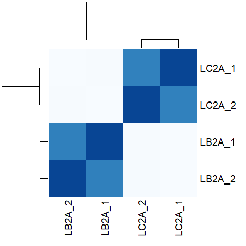

# Model-based RNA-Seq analysis
# Differential expression using a reference genome and pre-existing annotation. 

This repository is a publicly available tutorial for differential expression analysis using RNA-Seq data. All steps have been provided for the UConn CBC Xanadu cluster here with appropriate headers for the Slurm scheduler that can be modified simply to run.  Commands should never be executed on the submit nodes of any HPC machine.  If working on the Xanadu cluster, you should use `sbatch scriptname` after modifying the script for each stage.  Basic editing of all scripts can be performed on the server with tools such as `nano`, `vim`, or `emacs`.  If you are new to Linux, please use [this](https://bioinformatics.uconn.edu/unix-basics) handy guide for the operating system commands.  In this guide, you will be working with common bio Informatic file formats, such as [FASTA](https://en.wikipedia.org/wiki/FASTA_format), [FASTQ](https://en.wikipedia.org/wiki/FASTQ_format), [SAM/BAM](https://en.wikipedia.org/wiki/SAM_(file_format)), and [GFF3/GTF](https://en.wikipedia.org/wiki/General_feature_format). You can learn even more about each file format [here](https://bioinformatics.uconn.edu/resources-and-events/tutorials/file-formats-tutorial/). If you do not have a Xanadu account and are an affiliate of UConn/UCHC, please apply for one **[here](https://bioinformatics.uconn.edu/contact-us/)**.


Contents
1. [Overview](#1-overview)
2. [Accessing the Data using SRA-Toolkit](#2-accessing-the-data-using-sra-toolkit)  
3. [Quality control using Trimmomatic](#3-quality-control-using-Trimmomatic)
4. [FASTQC Before and After Quality Control](#4-fastqc-before-and-after-quality-control)
5. [Aligning Reads to a Genome using hisat2](#5-aligning-reads-to-a-genome-using-hisat2)
6. [Generating Total Read Counts from Alignment using htseq-count](#6-generating-total-read-counts-from-alignment-using-htseq-count)
7. [Pairwise differential expression with counts in R with DESeq2](#7-pairwise-differential-expression-with-counts-in-r-using-deseq2)
	1. [Common plots for differential expression analysis](#common-plots-for-differential-expression-analysis)
	2. [Using DESeq2](#using-deseq2)
7. [EnTAP: Functional Annotation for Genomes](#8-entap--functional-annotation-for-de-genes)
8. [Integrating the DE Results with the Annotation Results](#9-integrating-the-de-results-with-the-annotation-results)  


## 1. Overview  

In this study, transcriptional responses to three environmental stresses were examined in the large yellow croaker (_Larimichthys crocea_): heat stress (LC2A), cold stress (LA2A) and a 21-day fast (LF1A). mRNA was extracted from livers from from fishes from the three treatments and a control (LB2A) and sequenced on an Illumina HiSeq 2000. Sequencing was single-end, and each sequence is 90bp. 

For the purposes of this tutorial, we will compare the control (LB2A) to the heat stress treatment (LC2A). 

#### Cloning the tutorial repository

To work through this tutorial, copy it to your home directory using the `git clone` command:

```bash
git clone < git-repository-path.git > 
```  

Once you clone the repository you can see the following folder structure: 

```
Marine/
├── raw_data
├── quality_control
├── fastqc
├── index
├── align
├── count
└── entap
```

#### SLURM scripts
The scripts provided are configured to use SLURM, the workload managing software used on the Xanadu cluster. Such software is necessary to manage and equitably distribute resources on large computing clusters with many users. 

Each script contains a header section which specifies computational resources (processors, memory) needed to run the job. SLURM then puts the job in a queue and the runs it when the resources become available. The header section looks like this:

```
#!/bin/bash
#SBATCH --job-name=JOBNAME
#SBATCH -n 1
#SBATCH -N 1
#SBATCH -c 1
#SBATCH --mem=1G
#SBATCH --partition=general
#SBATCH --qos=general
#SBATCH --mail-type=ALL
#SBATCH --mail-user=first.last@uconn.edu
#SBATCH -o %x_%j.out
#SBATCH -e %x_%j.err
```

Before beginning, you need to understand a few aspects of the Xanadu server. When first logging into Xanadu from your local terminal, you will be connected to a **submit node**. The submit node is meant to serve as an **interface** for users, and under no circumstances should you use it to do serious computation. If you do, the system administrators may kill your job and send you a mean e-mail about it. This may cause you to lose work, and worse, feel badly about yourself. On the submit node you may manage and inspect files, write and edit scripts, and do other very light duty work. To analyze data, you need to request access to one or more **compute nodes** through SLURM. This tutorial will not teach you how to configure the SLURM header. Therefore, before moving on, it would be helpful to read and master the topics covered in the [Xanadu tutorial](https://bioinformatics.uconn.edu/resources-and-events/tutorials-2/xanadu/) and our [guide to resource requests](https://github.com/CBC-UCONN/CBC_Docs/wiki/Requesting-resource-allocations-in-SLURM).


## 2. Accessing the Data using SRA-Toolkit    

Before we can get started, we need to get the data we're going to analyze. This dataset has been deposited in the [Sequence Read Archive (SRA)](https://www.ncbi.nlm.nih.gov/sra) at NCBI, a comprehensive collection of sequenced genetic data submitted by researchers. The beauty of the SRA is the ease with which genetic data becomes accessible to any scientist with an internet connection. Sets of sequences (usually all the sequences from a given sample within an experiment) in the SRA have a unique identifier. The set may be downloaded using a software module called the `sratoolkit`. There are a variety of commands in the `sratoolkit`, which I invite you to investigate for yourself at [here](https://www.ncbi.nlm.nih.gov/books/NBK158900/).  

An overview of the project data can be viewed [here](https://www.ncbi.nlm.nih.gov/bioproject/PRJNA280841/). 

We will download data from the control samples (LB2A) and the heat stress treatment (LC2A). The SRA accessions are as follows:

LB2A : SRR1964642, SRR1964643  
LC2A : SRR1964644, SRR1964645  

We have provided a script to download the data from the the SRA data using SRA-Toolkit using [this script](/raw_data/fastqc_dump_xanadu.sh). It contains three sections. 

The SLURM header: 

```bash
#!/bin/bash
#SBATCH --job-name=fastq_dump_xanadu
#SBATCH -n 1
#SBATCH -N 1
#SBATCH -c 1
#SBATCH --mem=15G
#SBATCH --partition=general
#SBATCH --qos=general
#SBATCH --mail-type=ALL
#SBATCH --mail-user=first.last@uconn.edu
#SBATCH -o %x_%j.out
#SBATCH -e %x_%j.err
```

The download commands:

```
module load sratoolkit/2.8.1 

fastq-dump --gzip SRR1964642
fastq-dump --gzip SRR1964643
fastq-dump --gzip SRR1964644
fastq-dump --gzip SRR1964645
```

The line `module load sratoolkit/2.8.1` loads the `sratoolkit` so we can use it. Once downloaded, we rename the samples:  

```bash
mv SRR1964642.fastq.gz LB2A_SRR1964642.fastq.gz
mv SRR1964643.fastq.gz LB2A_SRR1964643.fastq.gz
mv SRR1964644.fastq.gz LC2A_SRR1964644.fastq.gz
mv SRR1964645.fastq.gz LC2A_SRR1964645.fastq.gz
```  

The full script for slurm scheduler can be found in the `raw_data` folder. Before running it, add your own e-mail address to the `--mail-user` option (or delete the line entirely if you don't want an e-mail notification when the job completes). 

When you're ready, you can execute the script by entering `sbatch fastqc_dump_xanadu.sh` in the terminal. This submits the job to the SLURM scheduler. 

Once the job is completed the folder structure will look like this:  

```
raw_data/
|-- fastq_dump_xanadu_NNNN.err
|-- fastq_dump_xanadu_NNNN.out
|-- LB2A_SRR1964642.fastq.gz
|-- LB2A_SRR1964643.fastq.gz
|-- LC2A_SRR1964644.fastq.gz
`-- LC2A_SRR1964645.fastq.gz
```   

The sequence files are in fastq format and compressed using gzip (indicated by the `.gz`). It's good practice to keep sequence files compressed. Most bioinformatics programs can read them directly without needing to decompress them first, and it doesn't get in the way of inspecting them either. The `.out` and `.err` files are output produced by SLURM that you can use to troubleshoot if things go wrong. Lets have a look at at the contents of one of the fastq files:  

```bash
zcat LB2A_SRR1964642.fastq.gz | head -n 12

@SRR1964642.1 FCC355RACXX:2:1101:1476:2162 length=90
CAACATCTCAGTAGAAGGCGGCGCCTTCACCTTCGACGTGGGGAATCGCTTCAACCTCACGGGGGCTTTCCTCTACACGTCCTGTCCGGA
+SRR1964642.1 FCC355RACXX:2:1101:1476:2162 length=90
?@@D?DDBFHHFFGIFBBAFG:DGHDFHGHIIIIC=D<:?BBCCCCCBB@BBCCCB?CCBB<@BCCCAACCCCC>>@?@88?BCACCBB>
@SRR1964642.2 FCC355RACXX:2:1101:1641:2127 length=90
NGCCTGTAAAATCAAGGCATCCCCTCTCTTCATGCACCTCCTGAAATAAAAGGGCCTGAATAATGTCGTACAGAAGACTGCGGCACAGAC
+SRR1964642.2 FCC355RACXX:2:1101:1641:2127 length=90
#1=DDFFFHHHHGJJJJJIIIJIJGIIJJJIJIJJGIJIJJJJIJJJJJJIJJJIJJJJJJJGIIHIGGHHHHHFFFFFDEDBDBDDDDD
@SRR1964642.3 FCC355RACXX:2:1101:1505:2188 length=90
GGACAACGCCTGGACTCTGGTTGGTATTGTCTCCTGGGGAAGCAGCCGTTGCTCCACCTCCACTCCTGGTGTCTATGCCCGTGTCACCGA
+SRR1964642.3 FCC355RACXX:2:1101:1505:2188 length=90
CCCFFFFFHHFFHJJJIIIJHHJJHHJJIJIIIJEHJIJDIJJIIJJIGIIIIJGHHHHFFFFFEEEEECDDDDEDEDDDDDDDADDDDD
```  

Each sequence record has four lines. The first is the sequence name, beginning with `@`. The second is the nucleotide sequence. The third is a comment line, beginning with `+`, and which here only contains the sequence name again (it is often empty). The fourth are [phred-scaled base quality scores](https://en.wikipedia.org/wiki/Phred_quality_score), encoded by [ASCII characters](https://drive5.com/usearch/manual/quality_score.html). Follow the links to learn more, but in short, the quality scores give the probability a called base is incorrect. 

## 3. Quality Control Using `Trimmomatic`  

`Trimmomatic` is commonly used to trim low quality and adapter contaminated sequences. 

Our usage looks like this for a single sample:

```bash
module load Trimmomatic/0.39

java -jar $Trimmomatic SE \
	-threads 12 \
	../raw_data/LB2A_SRR1964642.fastq.gz \
	LB2A_SRR1964642_trim.fastq.gz \
	ILLUMINACLIP:TruSeq3-SE.fa:2:30:10 \
	SLIDINGWINDOW:4:20 \
	MINLEN:45
```

We call `SE` for single-end mode, we request 12 processor threads be used, and we specify the input and output file names. The `ILLUMINACLIP:TruSeq3-SE.fa:2:30:10` command searches for adapter sequence, so we provide a fasta file containing the adapters used in the library preparation, and the numbers control the parameters of adapter matching (see the [manual](http://www.usadellab.org/cms/?page=trimmomatic) for more details). `SLIDINGWINDOW:4:20` scans through the read, cutting the read when the average base quality in a 4 base window drops below 20. We linked to an explanation of phred-scaled quality scores above, but for reference, scores of 10 and 20 correspond to base call error probabilities of 0.1 and 0.01, respectively. `MINLEN:45` causes reads to be dropped if they have been trimmed to less than 45bp.[Here](https://www.frontiersin.org/articles/10.3389/fgene.2014.00013/full) is a useful paper on setting trimming parameters for RNA-seq. 

The full script for slurm scheduler is called [fastq_trimming.sh](/quality_control/fastq_trimming.sh) which can be found in the **quality_control/** folder. Navigate there and run the script by enteriing `sbatch fastq_trimming.sh` on the command-line. 

Following the `trimmomatic` run, the resulting file structure will look as follows:  

```bash
quality_control/
├── fastq_trimming_NNNNN.err
├── fastq_trimming_NNNNN.out
├── fastq_trimming.sh
├── LB2A_SRR1964642_trim.fastq.gz
├── LB2A_SRR1964643.trim.fastq.gz
├── LC2A_SRR1964644.trim.fastq.gz
├── LC2A_SRR1964645.trim.fastq.gz
└── TruSeq3-SE.fa
```  

Examine the .out file generated during the run. Summaries of how many reads were retained for each file were written there. Here's one example:

```
TrimmomaticSE: Started with arguments:
 -threads 12 ../raw_data/LB2A_SRR1964642.fastq.gz LB2A_SRR1964642_trim.fastq.gz ILLUMINACLIP:TruSeq3-SE.fa:2:30:10 SLIDINGWINDOW:4:20 MINLEN:45
Using Long Clipping Sequence: 'AGATCGGAAGAGCGTCGTGTAGGGAAAGAGTGTA'
Using Long Clipping Sequence: 'AGATCGGAAGAGCACACGTCTGAACTCCAGTCAC'
ILLUMINACLIP: Using 0 prefix pairs, 2 forward/reverse sequences, 0 forward only sequences, 0 reverse only sequences
Quality encoding detected as phred33
Input Reads: 26424138 Surviving: 25664909 (97.13%) Dropped: 759229 (2.87%)
TrimmomaticSE: Completed successfully

```  

## 4. `FASTQC` Before and After Quality Control

It is helpful to see how the quality of the data has changed after using `Trimmomatic`. To do this, we will be using the command-line versions of `fastqc` and `MultiQC`. These two programs create visual reports of the average quality of our reads.  

```bash
dir="before"

module load fastqc/0.11.5
fastqc --outdir ./"$dir"/ ../raw_data/LB2A_SRR1964642.fastq.gz
fastqc --outdir ./"$dir"/ ../raw_data/LB2A_SRR1964643.fastq.gz
fastqc --outdir ./"$dir"/ ../raw_data/LC2A_SRR1964644.fastq.gz
fastqc --outdir ./"$dir"/ ../raw_data/LC2A_SRR1964645.fastq.gz
```  

The full script for slurm scheduler is called [fastqc_raw.sh](/fastqc/fastqc_raw.sh) and is located in the /fastqc folder.  

The same command can be run on the fastq files after the trimming using fastqc program, and the comand will look like this:
```bash
dir="after"

module load fastqc/0.11.5
fastqc --outdir ./"$dir"/ ../quality_control/LB2A_SRR1964642.trim.fastq.gz -t 8
fastqc --outdir ./"$dir"/ ../quality_control/LB2A_SRR1964643.trim.fastq.gz -t 8
fastqc --outdir ./"$dir"/ ../quality_control/LC2A_SRR1964644.trim.fastq.gz -t 8
fastqc --outdir ./"$dir"/ ../quality_control/LC2A_SRR1964645.trim.fastq.gz -t 8
```  

The full script for slurm scheduler is called [fastqc_trimmed.sh](/fastqc/fastqc_trimmed.sh) which is located in /fastqc folder.  
 
This will produce html files with the quality reports. The file strucutre inside the folder **fastqc/** will look like this:  

```
fastqc/
├── after
│   ├── trimmed_LB2A_SRR1964642_fastqc.html
│   ├── trimmed_LB2A_SRR1964642_fastqc.zip
│   ├── trimmed_LB2A_SRR1964643_fastqc.html
│   ├── trimmed_LB2A_SRR1964643_fastqc.zip
│   ├── trimmed_LC2A_SRR1964644_fastqc.html
│   ├── trimmed_LC2A_SRR1964644_fastqc.zip
│   ├── trimmed_LC2A_SRR1964645_fastqc.html
│   └── trimmed_LC2A_SRR1964645_fastqc.zip
├── before
│   ├── LB2A_SRR1964642_fastqc.html
│   ├── LB2A_SRR1964642_fastqc.zip
│   ├── LB2A_SRR1964643_fastqc.html
│   ├── LB2A_SRR1964643_fastqc.zip
│   ├── LC2A_SRR1964644_fastqc.html
│   ├── LC2A_SRR1964644_fastqc.zip
│   ├── LC2A_SRR1964645_fastqc.html
│   └── LC2A_SRR1964645_fastqc.zip
```  

To view the html files you need to download them to your laptop and open them in a web browser. You can use a xanadu node dedicated to file transfer: **transfer.cam.uchc.edu** and the unix utility `scp`. Copy the files as shown below, or use an FTP client with a graphical user interface such as FileZilla or Cyberduck: 

```bash
scp user-name@transfer.cam.uchc.edu:~/path/to/cloned/git/repository/fastqc/before/*.html .
```

The syntax is `scp x y`, meaning copy files `x` to location `y`. Do not forget the '**.**' at the end of the above code; which means to download the files to the current working directory in your computer. You can likewise download the **HTML** files for the trimmed reads. 
 
Let's have a look at the output from `fastqc`. When loading the fastqc file, you will be greeted with this screen  
  

There are some basic statistics which are all pretty self-explanatory. Notice that none of our sequence libraries fail the quality report! It would be concerning if we had even one because this report is from our trimmed sequence! The same thinking applies to our sequence length. Should the minimum of the sequence length be below 45, we would know that Trimmomatic had not run properly. Let's look at the next index in the file:  

  

This screen is simply a box-and-whiskers plot of our quality scores per base pair. Note that there is a large variance and lower mean scores (but still about in our desired range) for base pairs 1-5 and that sequence quality declines toward the 3' end of the read.  

  

This figure shows the distribution of mean read qualities. You can see we have a peak at about 38, which corresponds to a per base error probability of 0.00016. 

The last panel at which we are going to look is the "Overrepresented Sequences" panel:  
  

This is simply a list of sequences which appear disproportionately in our reads file. FastQC checks these against common adapter sequences and will flag them as such if they match. It is often the case in RNA-Seq that sequence from very highly expressed genes turns up in this panel. It may be helpful to try to identify some of these sequences using BLAST if they take up a large percentage of your library. 

When you have a large experiment with many samples, checking FastQC HTML files can be a tedious task. To get around this, you can use use a program called [MultiQC](https://multiqc.info/) to combine them into a single report. 

For HTML files in the **before/** folder:
```bash
module load MultiQC/1.1

multiqc --outdir raw_multiqc ./before/
``` 

For HTML file in the **after/** folder:
```bash
module load MultiQC/1.1

multiqc --outdir trimmed_multiqc ./after/
```  

The full slurm scripts are called [multiqc_raw.sh](/fastqc/multiqc_raw.sh) and [multiqc_trimmed.sh](/fastqc/multiqc_trimmed.sh) which can be found in the **fastqc/** folder.  As discribed above you may have to transfer these file to your computer to view them.


## 5. Aligning Reads to a Genome using `HISAT2`  

#### Downloading the genome and building the Index:  

HISAT2 is a fast and sensitive aligner for mapping next generation sequencing reads against a reference genome.
In order to map the reads to a reference genome we have to do a few things to prepare. First we must download the reference genome! We will download the reference genome (https://www.ncbi.nlm.nih.gov/genome/12197) from the NCBI database using the `wget` command.  

```bash
wget ftp://ftp.ncbi.nlm.nih.gov/genomes/all/GCF/000/972/845/GCF_000972845.2_L_crocea_2.0/GCF_000972845.2_L_crocea_2.0_genomic.fna.gz
gunzip GCF_000972845.2_L_crocea_2.0_genomic.fna.gz
```

Next, we need to create a genome _index_. What is an index and why is it helpful? Genome indexing is the same as indexing a tome, like an encyclopedia. It is much easier to locate information in the vastness of an encyclopedia when you consult the index, which is ordered in an easily navigable way with pointers to the information you seek within. Genome indexing similarly structures the information contained in a genome so that a read mapper can quickly find possible mapping locations. 

We will use the `hisat2-build` module to make a HISAT index file for the genome. It will create a set of files with the suffix .ht2, these files together comprise the index. The command to generate the index looks like this: 

```bash
module load hisat2/2.0.5
hisat2-build -p 4 GCF_000972845.2_L_crocea_2.0_genomic.fna L_crocea
```  

The full script can be found in the **index** folder by the name [hisat2_index.sh](/index/hisat2_index.sh). Navigate there and submit it by entering `sbatch hisat2_index.sh` on the command-line.   

After running the script, the following files will be generated as part of the index.  To refer to the index for mapping the reads in the next step, you will use the file prefix, which in this case is: L_crocea  

```bash
index/
|-- GCF_000972845.2_L_crocea_2.0_genomic.fna
|-- hisat2_index.sh
|-- L_crocea.1.ht2
|-- L_crocea.2.ht2
|-- L_crocea.3.ht2
|-- L_crocea.4.ht2
|-- L_crocea.5.ht2
|-- L_crocea.6.ht2
|-- L_crocea.7.ht2
`-- L_crocea.8.ht2
```

### Aligning the reads using `HISAT2`  

Once we have created the index, the next step is to align the reads to the reference genome with `HISAT2`. By default `HISAT2` outputs the alignments in SAM format. We won't go over the format in detail in this tutorial, but should you actually need to look at the alignment files, it would be helpful to read over the [format specification](https://samtools.github.io/hts-specs/SAMv1.pdf) or have a look the [wikipedia page](https://en.wikipedia.org/wiki/SAM_(file_format)). 

Raw SAM formatted files have two issues. First, they are uncompressed. Because of this they take up much more space than they need to and are slower to read and write. Second, `HISAT2` writes the alignments out in the same order it reads the sequences from the fastq file, but for downstream applications, they need to be sorted by **genome coordinate**. 

To deal with these issues, we'll use a _pipe_ to send the results from `HISAT2` to `samtools` to sort the sequences, convert them to binary format and compress them. The resulting files will be in BAM format. We can then use `samtools` to read or otherwise manipulate them. We use pipes rather than writing intermediate files because it is much more efficient computationally, and requires less cleanup of unneeded intermediate files. 

Here's our code for aligning one sample:

```bash
hisat2 -p 8 --dta -x ../index/L_crocea -U ../quality_control/LB2A_SRR1964642_trim.fastq.gz | \
	samtools view -S -h -u - | \
	samtools sort -T SRR1964642 - >LB2A_SRR1964642.bam
```  

The `|` is the pipe. It tells linux to use the output of the command to the left of the pipe as the input for the command to the right. You can chain together many commands using pipes. `samtools view` converts the SAM file produced by `hisat2` to uncompressed BAM. `-S` indicates the input is SAM format. `-h` indicates the SAM header should be written to the output. `-u` indicates that uncompressed BAM format should be written (no need to compress until the end). `-` indicates `samtools` should take input from the pipe. `samtools sort` sorts and compressed the file. `-T` gives a temporary file prefix. 

Because BAM files are large and we may want to access specific sections quickly, we need to _index_ the bam files, just like we indexed the genome. Here we'll use `samtools` again. As an example:

```bash
samtools index LB2A_SRR1964642.bam
```

This creates a `.bam.bai` index file to accompany each BAM file. 

Once the mapping and indexing have been completed, the file structure is as follows:  
```bash
align/
├── align_NNNNNN.err
├── align_NNNNNN.out
├── align.sh
├── LB2A_SRR1964642.bam
├── LB2A_SRR1964642.bam.bai
├── LB2A_SRR1964643.bam
├── LB2A_SRR1964643.bam.bai
├── LC2A_SRR1964644.bam
├── LC2A_SRR1964644.bam.bai
├── LC2A_SRR1964645.bam
└── LC2A_SRR1964645.bam.bai
```  

The full script for the slurm scheduler can be found in the **align/** directory by the name [align.sh](/align/align.sh). When you're ready, navigate there and execute it by entering `sbatch align.sh` on the command-line. 

When `HISAT2` finishes aligning all the reads, it will write a summary which will be captured by SLURM in the file ending `.err`. 

Alignment results for a single sample is shown below: 
```
25664909 reads; of these:
  25664909 (100.00%) were unpaired; of these:
    1114878 (4.34%) aligned 0 times
    23209585 (90.43%) aligned exactly 1 time
    1340446 (5.22%) aligned >1 times
95.66% overall alignment rate
```  

Let's have a look at the BAM file:
```bash
module load samtools/1.9
samtools view -H LB2A_SRR1964642.bam | head
```

which will give:
```bash
@HD	VN:1.0	SO:coordinate
@SQ	SN:NC_040011.1	LN:43682218
@SQ	SN:NC_040012.1	LN:14376772
@SQ	SN:NC_040013.1	LN:52095323
@SQ	SN:NC_040014.1	LN:6444570
@SQ	SN:NC_040015.1	LN:5657075
@SQ	SN:NC_040016.1	LN:27037660
@SQ	SN:NC_040017.1	LN:29365971
@SQ	SN:NC_040018.1	LN:33955600
@SQ	SN:NC_040019.1	LN:13800884
```

Here we've requested that `samtools` return only the header section, which contains lots of metadata about the file, including all the contig names in the genome (each @SQ line contains a contig name). Each line begins with an "@" sign. The header can be quite large, especially if there are many contigs in your reference. 

We can use `samtools` to access reads mapping to any part of the genome using the `view` submodule like this:

`samtools view LB2A_SRR1964642.bam NC_040019.1:171000-172000`

This will print to the screen all the reads that mapped to the genomic interval `NC_040019.1:171000-172000`. 

You can use pipes and other linux tools to get basic information about these reads:

`samtools view LB2A_SRR1964642.bam NC_040019.1:171000-172000 | wc -l`

`wc -l` counts lines of text, so this command indicates that 411 reads map to this 1kb interval. 


## 6. Generating Total Read Counts from Alignment using htseq-count  

Now we will be using the program `htseq-count` to count how many reads map to each annotated gene in the genome. To do this, we first need to download the annotation file. It is in GFF format. It can be done using the following command:  

```bash
wget ftp://ftp.ncbi.nlm.nih.gov/genomes/all/GCF/000/972/845/GCF_000972845.1_L_crocea_1.0/GCF_000972845.1_L_crocea_1.0_genomic.gff.gz
```   
Once downloaded and unziped, then you can count the features using the `htseq-count` program.  

```bash
htseq-count -s no -r pos -t gene -i Dbxref -f bam ../mapping/sort_trim_LB2A_SRR1964642.bam GCF_000972845.1_L_crocea_1.0_genomic.gff > LB2A_SRR1964642.counts
```

Command discription for the htseq-count will look like :  
```bash
Usage: htseq-count [options] alignment_file gff_file
Options:
  -f SAMTYPE, --format=SAMTYPE
                        type of  data, either 'sam' or 'bam'
                        (default: sam)
  -r ORDER, --order=ORDER
                        'pos' or 'name'. Sorting order of
                        (default: name). Paired-end sequencing data must be
                        sorted either by position or by read name, and the
                        sorting order must be specified. Ignored for single-
                        end data.
  -s STRANDED, --stranded=STRANDED
                        whether the data is from a strand-specific assay.
                        Specify 'yes', 'no', or 'reverse' (default: yes).
                        'reverse' means 'yes' with reversed strand
                        interpretation
  -t FEATURETYPE, --type=FEATURETYPE
                        feature type (3rd column in GFF file) to be used, all
                        features of other type are ignored (default, suitable
                        for Ensembl GTF files: exon)
  -i IDATTR, --idattr=IDATTR
                        GFF attribute to be used as feature ID (default,
                        suitable for Ensembl GTF files: gene_id)
``` 

The above command should be repeated for all other BAM files as well. The full script for slurm scheduler can be found in the **count/** folder which is called [htseq_count.sh](/count/htseq_count.sh).  

Once all the bam files have been counted, we will be having the following files in the count directory.  
```bash
counts/
|-- htseq.sh
|-- sort_trim_LB2A_SRR1964642.counts
|-- sort_trim_LB2A_SRR1964643.counts
|-- sort_trim_LC2A_SRR1964644.counts
`-- sort_trim_LC2A_SRR1964645.counts
```  

Let's have a look at the contents of a counts file:
```bash
head sort_trim_LB2A_SRR1964642.counts
```

which will look like:  
```
GeneID:104917625	18
GeneID:104917626	7
GeneID:104917627	0
GeneID:104917628	199
GeneID:104917629	71
GeneID:104917630	23
GeneID:104917631	111
GeneID:104917632	25
GeneID:104917634	276
GeneID:104917635	254
``` 

We see the layout is quite straightforward, with two columns separated by a tab. The first column identifies the gene from the eponymous sample and the second column is the number of mRNA strands from the row's gene found in the sample. This setup is perfect for our next task, identifying differentially expressed genes.  


## 7. Pairwise Differential Expression with Counts in R using DESeq2  

This part of the tutorial must be run locally. To download the appropriate files to your local computer, we will use the secure copy client, "scp". Close your Xanadu connection and run the following code:  

```bash
scp user_name@transfer.cam.uchc.edu:/Path-to-counts/*.counts /path-to-your-local-directory/  
```  


### Common plots for differential expression analysis  

To identify differentially expressed genes, We will use the DESeq2 package within Bioconductor in R to perform normalization and statistical analysis of differences among our two sample groups. For our differential expression analysis, we will be using three types of graphs to visualize the data: Bland-Altman (MA), heatmap, and PCA plots.  

### Bland-Altman(MA) Plot  
The Bland-Altman plot is a binary analysis, gathering information on the relationships between two-sets of data. Because we have four sets of data, we will be breaking our data into two separate groups (LB2A and LC2A), then generating two superimposed plots comparing each member of the two groups to each member of the other group. Before we go further, what is a Bland-Altman plot? An MA plot is the comparison of the log-differences for two datasets to the log-averages.  

```
M = log2(D1/D2) = log2(D1)-log2(D2)
A = ½log2(D1D2) = ½(log2(D1)+log2(D2))
``` 

with D1 and D2 being datasets 1 and 2, respectively. We plot M on the vertical axis and A on the horizontal axis. We see here that should two datapoints from datasets 1 and 2 be equal, they will plot at (D1==D2, 0). Therefore, should our entire plot run along y=0, it is safe to say, that for us, none of our genes were differentially expressed. However, should there be large deviations from y=0, we are provided with insight that we may have differentially expressed genes.  


### Heatmap  
Heatmaps are the most readily readable visualizations for determining differential expression. Heatmaps are discrete plots. That is, the values along the x and y axis move in integer increments, with no places in-between. Typically, the x-and-y axes contain different types of information about each dataset, and combine to capture the whole image of the dataset. For us, we may find it useful to make one axis our groups (our four datasets) and the other axis the genes sampled from those datasets. Now each cell in our grid will correspond to the expression of a gene from a sample. We then assign a color-palette to each possible range of gene expression. For instance, an expression between 300-500 may be blue while an expression of 501-1000 may be violet. After coloring all of our cells responsibly, we now have simple, discrete snapshots of each datasets expression distribution. Should we notice that two groups have very similar looking snapshots, we may cluster those groups safely with the assumption that they do not share differentially expressed genes, and therefore belong to the same space.  

### Principal Component Analysis(PCA)  
Principal component analysis (PCA) is a technique used to emphasize variation and bring out strong patterns in a dataset. It's often used to make data easy to explore and visualize. It is a mathematical procedure that transforms a number of corrlated variables into a smaller number of uncorrelated variables called principle components. The first principal component accounts for as much of the variability in the data as possible, and each succeding component accounts for as much of the remaining variability as possible.  


### Using DESeq2  
The DESeq2 vignette comes with complete instructions on how to use DESeq2 for analysis. If you are ever confused, visit the vignette, find the appropriate step and read up. This is true for most Bioconductor packages. Before going forward make sure you have downloaded the **DESeq2** package from the **bioconductor** webside. Depending on the version of R in your computer method of download the install might vari, so please refer to the [**bioconductor website**](https://www.bioconductor.org/) . Now, let's begin loading our data:  


```R
# Load DESeq2 library
library("DESeq2")
# Set the working directory
directory <- "~/your_directory_with_htseq_counts"
setwd(directory)
list.files(directory)
``` 
We will be generating a variety of files. We want the names of the files to inform us of exactly what information is contained in each file. The data is from the Croaker dataset, and we are analyzing the data with DESeq2. We choose an "outputPrefix" which, as the name suggests, will prefix all of our files.   

```R 
# Set the prefix for each output file name
outputPrefix <- "Croaker_DESeq2"

sampleFiles<- c("LB2A_SRR1964642.counts","LB2A_SRR1964643.counts",
                "LC2A_SRR1964644.counts", "LC2A_SRR1964645.counts")
# Liver mRNA profiles of control group: (LB2A) 
# Liver mRNA profiles of thermal stress group: (LC2A)
# ""CONTROL"" LB2A_1: LB2A_SRR1964642.counts, LB2A_2: LB2A_SRR1964643.counts
# ""TREATED"" LC2A_1: LB2A_SRR1964644.counts, LC2A_2: LC2A_SRR1964645.counts
```

The vignette informs us that DESeq2 performs three main steps in its differential expression analysis: estimating size factors, estimating dispersion, and conducting the Wald Test. These steps are completed so as to fit a negative binomial distribution. Let's review these terms, first:

Estimating size factors: This step operates under the simple assumption that if a sample is up-regulated then its transcriptome is larger than those which are not up-regulated. Suppose we have two samples, A and B. Every gene in A has been up-regulated by a factor of 2 and B is unchanged. If we took the proportion of gene expression in both samples they would return the same value! While A is twice as expressed, its transcriptome is twice as large. Our analysis would then conclude that no genes were differentially expressed, even though they all were. Estimating size factors is a more succinct way of stating that DESeq2 finds an idealized transcriptome size for all of the samples. Now all of the individual gene count proportions are calculating using the idealized transcriptome size and not the individual sample size. Because the gene counts themselves are not changed, our analysis will now return that each gene is differentially expressed with a fold change of two.

Estimating Dispersion: Dispersion is another term for variance, or the distance we expect a random gene count to be away from the average gene count. While the negative binomial distribution is modeled with the parameters of probability of success, number of successes, and number of failures, we cannot create our distribution with these values. . . because we do not know them! Furthermore, we cannot calculate the number of failures because if a read failed to map then it isn't present in the counts file. We can get around this hurdle by reparameterizing the negative binomial distribution in terms of the mean and variance. Our size factor from before is technically our mean, which leaves us with having to determine the variance. Through a series of mathematical and statistical manipulations, DESeq2 calculates the idealized variance of our samples.  

Wald Test: The Wald Test is a statistical test which can be used to assess the confidence in the results. After we finish creating our experimental distributions, the value of each gene in our experimental distribution is compared to its hypothetical value in the model distribution. By taking the ratio we get the percent similarity. Lastly, subtracting our percent similarity from 1 will give us our percent dissimilarity. This is the value DESeq2 returns as our p-value. You can think of this value as the percentage of chance that we're wrong about the fold change of a differentially expressed gene. Typically, we take all genes with p-values below 0.05. This is not the true Wald Test, but is the purpose behind the true statistic.

Furthermore, DESeq2 informs us that clicking on any individual step will present us with instructions. Our first step is estimating our size factors.  

We see that the only argument we need is a DESeq dataset. Let's create ours. From looking at the homepage of the DESeq2 vignete, we see that the "object" argument comes with links for a variety of data sources. Our data is from htseq-count, so we click on "DESeqDataSetFromHTSeqCount" in object row of the arguments.  

We follow these instructions exactly to create our DESeq object:  


```R 
sampleNames <- c("LB2A_1","LB2A_2","LC2A_1","LC2A_2")
sampleCondition <- c("control","control","treated","treated")

sampleTable <- data.frame(sampleName = sampleNames,
                          fileName = sampleFiles,
                          condition = sampleCondition)

ddsHTSeq <- DESeqDataSetFromHTSeqCount(sampleTable = sampleTable,
                                       directory = directory,
                                       design = ~ condition)
```

After creating our DESeq object, we go back to the DESeq function vignette. Very pleasantly, we see that it is as easy as typing "DESeq(object)". Afterwards, the vignette informs us that "results(dds)" will calculate the complete results, including p-values, fold changes, and more.  

```R
#By default, R will choose a reference level for factors based on alphabetical order. 
# To chose the reference we can use: factor()
treatments <- c("control","treated")
ddsHTSeq$condition
#Setting the factor levels
colData(ddsHTSeq)$condition <- factor(colData(ddsHTSeq)$condition,
                                      levels = treatments)
ddsHTSeq$condition

# Differential expression analysis
#differential expression analysis steps are wrapped into a single function, DESeq()
dds <- DESeq(ddsHTSeq)
# results table will be generated using results() which will include:
#  log2 fold changes, p values and adjusted p values
res <- results(dds)
res
summary(res)
# filter results by p value
res= subset(res, padj<0.05)

# order results by padj value (most significant to least)
res <- res[order(res$padj),]
# should see DataFrame of baseMean, log2Foldchange, stat, pval, padj

# save data results and normalized reads to csv
resdata <- merge(as.data.frame(res), 
                 as.data.frame(counts(dds,normalized =TRUE)), 
                 by = 'row.names', sort = FALSE)
names(resdata)[1] <- 'gene'

write.csv(resdata, file = paste0(outputPrefix, "-results-with-normalized.csv"))

# send normalized counts to tab delimited file for GSEA, etc.
write.table(as.data.frame(counts(dds),normalized=T), 
            file = paste0(outputPrefix, "_normalized_counts.txt"), sep = '\t')

# produce DataFrame of results of statistical tests
mcols(res, use.names = T)
write.csv(as.data.frame(mcols(res, use.name = T)),
          file = paste0(outputPrefix, "-test-conditions.csv"))

# replacing outlier value with estimated value as predicted by distrubution using
# "trimmed mean" approach. recommended if you have several replicates per treatment
# DESeq2 will automatically do this if you have 7 or more replicates

ddsClean <- replaceOutliersWithTrimmedMean(dds)
ddsClean <- DESeq(ddsClean)
temp_ddsClean <- ddsClean
tab <- table(initial = results(dds)$padj < 0.05,
             cleaned = results(ddsClean)$padj < 0.05)
addmargins(tab)
write.csv(as.data.frame(tab),file = paste0(outputPrefix, "-replaceoutliers.csv"))
resClean <- results(ddsClean)
resClean = subset(res, padj<0.05)
resClean <- resClean[order(resClean$padj),]
write.csv(as.data.frame(resClean),file = paste0(outputPrefix, "-replaceoutliers-results.csv"))
```
When you execute the above code, it will create the above mentioned csv files with information. From the above csv files created  `Croaker_DESeq2-results-with-normalized.csv` will contain the filtered results by p adjusted value of 0.05 and the corrosponding normalized counts. This csv file will be used in the next step (EnTAP) to find the functional annotation of genes.   

Let's now create our visuals:  
```R 
####################################################################################
# Exploratory data analysis of RNAseq data with DESeq2
#
# these next R scripts are for a variety of visualization, QC and other plots to
# get a sense of what the RNAseq data looks like based on DESEq2 analysis
#
# 1) MA plot
# 2) rlog stabilization and variance stabiliazation
# 3) PCA plot
# 4) heatmap of clustering analysis
#
#
####################################################################################

# MA plot of RNAseq data for entire dataset
# http://en.wikipedia.org/wiki/MA_plot
# genes with padj < 0.1 are colored Red
plotMA(dds, ylim=c(-8,8),main = "RNAseq experiment")
dev.copy(png, paste0(outputPrefix, "-MAplot_initial_analysis.png"))
dev.off() 

# transform raw counts into normalized values
# DESeq2 has two options:  1) rlog transformed and 2) variance stabilization
# variance stabilization is very good for heatmaps, etc.
rld <- rlogTransformation(dds, blind=T)
vsd <- varianceStabilizingTransformation(dds, blind=T)

# save normalized values
write.table(as.data.frame(assay(rld),file = paste0(outputPrefix, "-rlog-transformed-counts.txt"), sep = '\t'))
write.table(as.data.frame(assay(vsd),file = paste0(outputPrefix, "-vst-transformed-counts.txt"), sep = '\t'))


# clustering analysis
# excerpts from http://dwheelerau.com/2014/02/17/how-to-use-deseq2-to-analyse-rnaseq-data/
library("RColorBrewer")
library("gplots")
sampleDists <- dist(t(assay(rld)))
suppressMessages(library("RColorBrewer"))
sampleDistMatrix <- as.matrix(sampleDists)
rownames(sampleDistMatrix) <- paste(colnames(rld), rld$type, sep="")
colnames(sampleDistMatrix) <- paste(colnames(rld), rld$type, sep="")
colors <- colorRampPalette( rev(brewer.pal(8, "Blues")) )(255)
heatmap(sampleDistMatrix,col=colors,margin = c(8,8))
dev.copy(png,paste0(outputPrefix, "-clustering.png"))
dev.off()

#Principal components plot shows additional but rough clustering of samples
library("genefilter")
library("ggplot2")
library("grDevices")

rv <- rowVars(assay(rld))
select <- order(rv, decreasing=T)[seq_len(min(500,length(rv)))]
pc <- prcomp(t(assay(vsd)[select,]))

# set condition
condition <- treatments
scores <- data.frame(pc$x, condition)

(pcaplot <- ggplot(scores, aes(x = PC1, y = PC2, col = (factor(condition))))
  + geom_point(size = 5)
  + ggtitle("Principal Components")
  + scale_colour_brewer(name = " ", palette = "Set1")
  + theme(
    plot.title = element_text(face = 'bold'),
    legend.position = c(.9,.2),
    legend.key = element_rect(fill = 'NA'),
    legend.text = element_text(size = 10, face = "bold"),
    axis.text.y = element_text(colour = "Black"),
    axis.text.x = element_text(colour = "Black"),
    axis.title.x = element_text(face = "bold"),
    axis.title.y = element_text(face = 'bold'),
    panel.grid.major.x = element_blank(),
    panel.grid.major.y = element_blank(),
    panel.grid.minor.x = element_blank(),
    panel.grid.minor.y = element_blank(),
    panel.background = element_rect(color = 'black',fill = NA)
  ))
#dev.copy(png,paste0(outputPrefix, "-PCA.png"))
ggsave(pcaplot,file=paste0(outputPrefix, "-ggplot2.png"))


# heatmap of data
library("RColorBrewer")
library("gplots")
# 1000 top expressed genes with heatmap.2
select <- order(rowMeans(counts(ddsClean,normalized=T)),decreasing=T)[1:100]
my_palette <- colorRampPalette(c("blue",'white','red'))(n=100)
heatmap.2(assay(vsd)[select,], col=my_palette,
          scale="row", key=T, keysize=1, symkey=T,
          density.info="none", trace="none",
          cexCol=0.6, labRow=F,
          main="Heatmap of 100 DE Genes in Liver Tissue Comparison")
dev.copy(png, paste0(outputPrefix, "-HEATMAP.png"))
dev.off()
```





## 8. EnTAP – Functional Annotation for DE Genes  

For this step we will go back to the cluster, and our working directory will be **entap/**. We will now transfer the csv file named `Croaker_DESeq2-results-with-normalized.csv` from the DESeq analysis to this folder. Once the transfer is complete the entap directory should have the above csv file.   
```
entap
├── Croaker_DESeq2-results-with-normalized.csv
```


Once the differentially expressed genes have been identified, we need to annotate the genes to identify the function. We will take the top 9 genes from the csv file to do a quick annotation. Will be useing the head command on the file, which will take the first 10 lines, and pipe it into a new file called temp.csv. 


```bash
head -n 10 Croaker_DESeq2-results-with-normalized.csv > temp.csv 
```

Then we are going to use a script which will link the geneID’s to the proteinID’s using the genome annotation in [tabular format](https://www.ncbi.nlm.nih.gov/genome/proteins/12197?genome_assembly_id=229515) (ProteinTable12197_229515.txt) which can be downloaded from the NCBI website.  

So the script will take the gene id’s from the temp.csv file and match it to the ProteinTable12197_229515.txt file and get the corresponding protein id’s. Then it will use that protein id to grab the fasta sequence from the protein fasta file.  

```bash
python csvGeneID2fasta.py temp.csv ProteinTable12197_229515.txt GCF_000972845.1_L_crocea_1.0_protein.faa > GeneID_proteinID.txt
```  

The program usage:
```bash
Usage:
      python csvGeneID2fasta.py [DE gene csv file] [tabular txt file] [fasta file]
```  

The full script is called [csvGeneID2fasta.sh](/entap/csvGeneID2fasta.sh) which is located at entap folder.

It will create a fasta file called “fasta_out.fasta” which will include the protein fasta sequences which we will be using for the enTAP job.  

```bash
entap/
|-- Croaker_DESeq2-results-with-normalized.csv
|-- csvGeneID2fasta.py
|-- temp.csv
|-- GCF_000972845.1_L_crocea_1.0_protein.faa
|-- ProteinTable12197_229515.txt
|-- GeneID_proteinID.txt
`-- fasta_out.fasta
```  

Now you are all set to run EnTAP program, but before that you need to make sure entap_config.txt file is created in your working directory. For this exercise we have created the `entap_config.txt` file for you inthe **entap/** directory.  

Once we have the fasta file with the protein sequences we can run the enTAP program to grab the functional annotations using the following command:

```bash
module load EnTAP/0.9.0-beta
module load diamond/0.9.19

EnTAP --runP -i fasta_out.fasta -d /isg/shared/databases/Diamond/RefSeq/vertebrate_other.protein.faa.97.dmnd -d /isg/shared/databases/Diamond/Uniprot/uniprot_sprot.dmnd --ontology 0  --threads 16 
```  

Usage of the entap program:
```bash
Required Flags:
--runP      with a protein input, frame selection will not be ran and annotation will be executed with protein sequences (blastp)
-i          Path to the transcriptome file (either nucleotide or protein)
-d          Specify up to 5 DIAMOND indexed (.dmnd) databases to run similarity search against

Optional:
-threads    Number of threads
--ontology  0 - EggNOG (default)
```

The full script for slurm scheduler can be found in the entap folder which is called [entap.sh](/entap/entap.sh)  

Once the job is done it will create a folder called “outfiles” which will contain the output of the program.  
```bash
entap/
|-- outfiles/
|   |-- debug_2018.2.25-2h49m29s.txt
|   |-- entap_out/
|   |-- final_annotated.faa
|   |-- final_annotations_lvl0_contam.tsv
|   |-- final_annotations_lvl0_no_contam.tsv
|   |-- final_annotations_lvl0.tsv
|   |-- final_annotations_lvl3_contam.tsv
|   |-- final_annotations_lvl3_no_contam.tsv
|   |-- final_annotations_lvl3.tsv
|   |-- final_annotations_lvl4_contam.tsv
|   |-- final_annotations_lvl4_no_contam.tsv
|   |-- final_annotations_lvl4.tsv
|   |-- final_unannotated.faa
|   |-- final_unannotated.fnn
|   |-- log_file_2018.2.25-2h49m29s.txt
|   |-- ontology/
|   `-- similarity_search/
```  


## 9. Integrating the DE Results with the Annotation Results  

For this step you need to copy the following two files from the entap run to your computer, which is “GeneID_proteinID.txt” and “final_annotations_lvl0_contam.tsv” file from the previous run. The two files are located at:  

```bash
entap/
|-- GeneID_proteinID.txt
|-- outfiles/
|   |-- final_annotations_lvl0_contam.tsv
```

Then we are going to integrate the annotations to the DE genes using the following R code:  

```R 
library("readr")
#read the csv file with DE genes
csv <- read.csv("Croaker_DESeq2-results-with-normalized.csv")
#read the file with geneID to proteinID relationship
gene_protein_list <- read.table("GeneID_proteinID.txt")
names(gene_protein_list) <- c('GeneID','table', 'tableID','protein', 'protienID')
gene_protein_list <- gene_protein_list[,c("GeneID","protienID")]

#merging the two dataframes
DEgene_proteinID <- merge(csv, gene_protein_list, by.x="gene", by.y="GeneID")

#read_tsv
annotation_file <- read_tsv('final_annotations_lvl0.tsv', col_names = TRUE)
names(annotation_file)[1] <- 'query_seqID'

#merging the DEgene_proteinID with annotation_file dataframes
annotated_DEgenes <- merge(DEgene_proteinID, annotation_file, by.x="protienID", by.y="query_seqID")
View(annotated_DEgenes)
write.csv(annotated_DEgenes, file = paste0("annotated_DEgenes_final.csv"))
``` 


